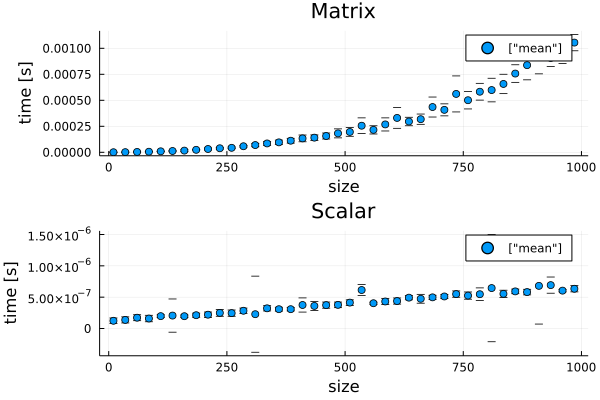

## Współczynik podpierdzialności [6/6]


### Zadanie 
- Napisać program w języku Julia do obliczania iloczynu skalarnego wektorów (<a href="https://docs.julialang.org/en/v1/stdlib/LinearAlgebra/#LinearAlgebra.dot">LinearAlgebra.dot</a>) i mnożenia macierzy kwadratowej przez wektor z użyciem 
<a href="https://docs.julialang.org/en/v1/stdlib/LinearAlgebra/#Elementary-operations-1">operatora *</a>.
- Uruchomić i zmierzyć czasy działania obydwu funkcji - każdej dla różnych rozmiarów wektorów.  Dokonać 10 pomiarów dla każdego rozmiaru wektora.
- Czasy działania powinny  być zapisywane do <b>jednego</b> pliku CSV. Należy zaplanować odpowiednią strukturę kolumn takiego pliku.
- Wczytać dane z w/w pliku do <b>jednego</b> DataFrame w języku Julia. 
- Korzystająć z mechanizmów DataFrame w języku Julia obliczyć średnią i odchylenie standardowe, w taki sposób, aby narysować wykresy średnich czasów obliczenia operacji w zależności od rozmiaru wektora. Dodać słupki błędów do obydwu wykresów uzyskanych z obliczenia odchylenia standardowego. 
- Proszę poukładac wykresy  w tabelkę za pomocą  opcji layouts: https://docs.juliaplots.org/latest/layouts/#Simple-Layouts-1.
- Należy zadbać o staranne podpisanie osi i wykresów.


```julia
using LinearAlgebra
using CSV
using DataFrames
using Statistics
using Plots
```


```julia
ScalarProduct(v1::Vector,v2::Vector)=dot(v1,v2)
MatrixProduct(A::Matrix,v::Vector) = A*v
```


    MatrixProduct (generic function with 1 method)


```julia
prev=DataFrame(Function=String[],Size=Int[],Time=Float64[])
```


<div class="data-frame"><p>0 rows × 3 columns</p><table class="data-frame"><thead><tr><th></th><th>Function</th><th>Size</th><th>Time</th></tr><tr><th></th><th title="String">String</th><th title="Int64">Int64</th><th title="Float64">Float64</th></tr></thead><tbody></tbody></table></div>


```julia
function TimeScalar(v1::Vector,v2::Vector,range::Int)
    @elapsed dot(v1,v2)
    for i in 1:range
        push!(prev,("Scalar",size(v1)[1],@elapsed dot(v1,v2)))
    end
end
```


    TimeScalar (generic function with 1 method)


```julia
function TimeMatrix(A::Matrix,v::Vector,range::Int)
    @elapsed A*v
    for i in 1:range
        push!(prev,("Matrix",size(v)[1],@elapsed A*v))
    end
end
```


    TimeMatrix (generic function with 1 method)


```julia
for i in 10:25:1000
    TimeMatrix(rand([0,1],i,i),rand([0,1],i),100)
    TimeScalar(rand([0,1],i),rand([0,1],i),100)
end
```


```julia
CSV.write("newfile.csv",prev)
show(prev)
```

    8000×3 DataFrame
      Row │ Function  Size   Time    
          │ String    Int64  Float64 
    ──────┼──────────────────────────
        1 │ Matrix       10   7.0e-7
        2 │ Matrix       10   3.1e-6
        3 │ Matrix       10   7.0e-7
        4 │ Matrix       10   4.0e-7
        5 │ Matrix       10   6.0e-7
        6 │ Matrix       10   6.0e-7
        7 │ Matrix       10   5.0e-7
        8 │ Matrix       10   6.0e-7
        9 │ Matrix       10   5.0e-7
       10 │ Matrix       10   6.0e-7
       11 │ Matrix       10   5.0e-7
      ⋮   │    ⋮        ⋮       ⋮
     7991 │ Scalar      985   6.0e-7
     7992 │ Scalar      985   6.0e-7
     7993 │ Scalar      985   7.0e-7
     7994 │ Scalar      985   6.0e-7
     7995 │ Scalar      985   7.0e-7
     7996 │ Scalar      985   6.0e-7
     7997 │ Scalar      985   7.0e-7
     7998 │ Scalar      985   6.0e-7
     7999 │ Scalar      985   6.0e-7
     8000 │ Scalar      985   6.0e-7
                    7979 rows omitted


```julia
df=CSV.read("newfile.csv",delim=",",DataFrame)
show(df)
```

    8000×3 DataFrame
      Row │ Function  Size   Time    
          │ String7   Int64  Float64 
    ──────┼──────────────────────────
        1 │ Matrix       10   7.0e-7
        2 │ Matrix       10   3.1e-6
        3 │ Matrix       10   7.0e-7
        4 │ Matrix       10   4.0e-7
        5 │ Matrix       10   6.0e-7
        6 │ Matrix       10   6.0e-7
        7 │ Matrix       10   5.0e-7
        8 │ Matrix       10   6.0e-7
        9 │ Matrix       10   5.0e-7
       10 │ Matrix       10   6.0e-7
       11 │ Matrix       10   5.0e-7
      ⋮   │    ⋮        ⋮       ⋮
     7991 │ Scalar      985   6.0e-7
     7992 │ Scalar      985   6.0e-7
     7993 │ Scalar      985   7.0e-7
     7994 │ Scalar      985   6.0e-7
     7995 │ Scalar      985   7.0e-7
     7996 │ Scalar      985   6.0e-7
     7997 │ Scalar      985   7.0e-7
     7998 │ Scalar      985   6.0e-7
     7999 │ Scalar      985   6.0e-7
     8000 │ Scalar      985   6.0e-7
                    7979 rows omitted


```julia
describe(df)
```


<div class="data-frame"><p>3 rows × 7 columns</p><table class="data-frame"><thead><tr><th></th><th>variable</th><th>mean</th><th>min</th><th>median</th><th>max</th><th>nmissing</th><th>eltype</th></tr><tr><th></th><th title="Symbol">Symbol</th><th title="Union{Nothing, Float64}">Union…</th><th title="Any">Any</th><th title="Union{Nothing, Float64}">Union…</th><th title="Any">Any</th><th title="Int64">Int64</th><th title="DataType">DataType</th></tr></thead><tbody><tr><th>1</th><td>Function</td><td></td><td>Matrix</td><td></td><td>Scalar</td><td>0</td><td>String7</td></tr><tr><th>2</th><td>Size</td><td>497.5</td><td>10</td><td>497.5</td><td>985</td><td>0</td><td>Int64</td></tr><tr><th>3</th><td>Time</td><td>0.00015361</td><td>1.0e-7</td><td>7.0e-7</td><td>0.0016893</td><td>0</td><td>Float64</td></tr></tbody></table></div>


```julia
gdf=groupby(df,[:Function,:Size])
gdf=combine(gdf,:Time=>std,:Time=>mean)
```


<div class="data-frame"><p>80 rows × 4 columns</p><table class="data-frame"><thead><tr><th></th><th>Function</th><th>Size</th><th>Time_std</th><th>Time_mean</th></tr><tr><th></th><th title="String7">String7</th><th title="Int64">Int64</th><th title="Float64">Float64</th><th title="Float64">Float64</th></tr></thead><tbody><tr><th>1</th><td>Matrix</td><td>10</td><td>2.79919e-7</td><td>5.23e-7</td></tr><tr><th>2</th><td>Matrix</td><td>35</td><td>8.87768e-7</td><td>1.307e-6</td></tr><tr><th>3</th><td>Matrix</td><td>60</td><td>3.41364e-7</td><td>3.306e-6</td></tr><tr><th>4</th><td>Matrix</td><td>85</td><td>9.84721e-7</td><td>5.389e-6</td></tr><tr><th>5</th><td>Matrix</td><td>110</td><td>1.43239e-6</td><td>9.372e-6</td></tr><tr><th>6</th><td>Matrix</td><td>135</td><td>2.91234e-6</td><td>1.2399e-5</td></tr><tr><th>7</th><td>Matrix</td><td>160</td><td>8.35454e-6</td><td>1.6082e-5</td></tr><tr><th>8</th><td>Matrix</td><td>185</td><td>2.6713e-6</td><td>2.3718e-5</td></tr><tr><th>9</th><td>Matrix</td><td>210</td><td>1.00225e-5</td><td>3.1638e-5</td></tr><tr><th>10</th><td>Matrix</td><td>235</td><td>7.59075e-6</td><td>3.869e-5</td></tr><tr><th>11</th><td>Matrix</td><td>260</td><td>7.92004e-6</td><td>4.2972e-5</td></tr><tr><th>12</th><td>Matrix</td><td>285</td><td>8.19358e-6</td><td>5.7975e-5</td></tr><tr><th>13</th><td>Matrix</td><td>310</td><td>1.59476e-5</td><td>6.9545e-5</td></tr><tr><th>14</th><td>Matrix</td><td>335</td><td>1.84258e-5</td><td>8.5072e-5</td></tr><tr><th>15</th><td>Matrix</td><td>360</td><td>2.17178e-5</td><td>9.5464e-5</td></tr><tr><th>16</th><td>Matrix</td><td>385</td><td>2.29841e-5</td><td>0.000111333</td></tr><tr><th>17</th><td>Matrix</td><td>410</td><td>3.25135e-5</td><td>0.000133611</td></tr><tr><th>18</th><td>Matrix</td><td>435</td><td>2.61869e-5</td><td>0.000140767</td></tr><tr><th>19</th><td>Matrix</td><td>460</td><td>2.87085e-5</td><td>0.000156518</td></tr><tr><th>20</th><td>Matrix</td><td>485</td><td>4.33027e-5</td><td>0.000181942</td></tr><tr><th>21</th><td>Matrix</td><td>510</td><td>4.17734e-5</td><td>0.000195572</td></tr><tr><th>22</th><td>Matrix</td><td>535</td><td>7.55303e-5</td><td>0.000255531</td></tr><tr><th>23</th><td>Matrix</td><td>560</td><td>3.95808e-5</td><td>0.00021555</td></tr><tr><th>24</th><td>Matrix</td><td>585</td><td>6.30196e-5</td><td>0.000267976</td></tr><tr><th>25</th><td>Matrix</td><td>610</td><td>9.99851e-5</td><td>0.00033036</td></tr><tr><th>26</th><td>Matrix</td><td>635</td><td>4.07149e-5</td><td>0.000295931</td></tr><tr><th>27</th><td>Matrix</td><td>660</td><td>4.94674e-5</td><td>0.000318272</td></tr><tr><th>28</th><td>Matrix</td><td>685</td><td>9.60995e-5</td><td>0.000435199</td></tr><tr><th>29</th><td>Matrix</td><td>710</td><td>5.77237e-5</td><td>0.000408131</td></tr><tr><th>30</th><td>Matrix</td><td>735</td><td>0.000173187</td><td>0.000561231</td></tr><tr><th>&vellip;</th><td>&vellip;</td><td>&vellip;</td><td>&vellip;</td><td>&vellip;</td></tr></tbody></table></div>


```julia
gdf_Scalar=gdf[gdf.Function.=="Scalar",:]
```


<div class="data-frame"><p>40 rows × 4 columns</p><table class="data-frame"><thead><tr><th></th><th>Function</th><th>Size</th><th>Time_std</th><th>Time_mean</th></tr><tr><th></th><th title="String7">String7</th><th title="Int64">Int64</th><th title="Float64">Float64</th><th title="Float64">Float64</th></tr></thead><tbody><tr><th>1</th><td>Scalar</td><td>10</td><td>4.46196e-8</td><td>1.23e-7</td></tr><tr><th>2</th><td>Scalar</td><td>35</td><td>4.85237e-8</td><td>1.37e-7</td></tr><tr><th>3</th><td>Scalar</td><td>60</td><td>4.73116e-8</td><td>1.72e-7</td></tr><tr><th>4</th><td>Scalar</td><td>85</td><td>5.1434e-8</td><td>1.59e-7</td></tr><tr><th>5</th><td>Scalar</td><td>110</td><td>2.22702e-8</td><td>1.97e-7</td></tr><tr><th>6</th><td>Scalar</td><td>135</td><td>2.65079e-7</td><td>2.06e-7</td></tr><tr><th>7</th><td>Scalar</td><td>160</td><td>1.96946e-8</td><td>1.96e-7</td></tr><tr><th>8</th><td>Scalar</td><td>185</td><td>3.26599e-8</td><td>2.12e-7</td></tr><tr><th>9</th><td>Scalar</td><td>210</td><td>4.26401e-8</td><td>2.2e-7</td></tr><tr><th>10</th><td>Scalar</td><td>235</td><td>5.41136e-8</td><td>2.49e-7</td></tr><tr><th>11</th><td>Scalar</td><td>260</td><td>5.0e-8</td><td>2.45e-7</td></tr><tr><th>12</th><td>Scalar</td><td>285</td><td>4.27702e-8</td><td>2.83e-7</td></tr><tr><th>13</th><td>Scalar</td><td>310</td><td>6.07209e-7</td><td>2.28e-7</td></tr><tr><th>14</th><td>Scalar</td><td>335</td><td>4.16333e-8</td><td>3.22e-7</td></tr><tr><th>15</th><td>Scalar</td><td>360</td><td>3.07482e-8</td><td>3.08e-7</td></tr><tr><th>16</th><td>Scalar</td><td>385</td><td>2.7266e-8</td><td>3.08e-7</td></tr><tr><th>17</th><td>Scalar</td><td>410</td><td>1.1315e-7</td><td>3.75e-7</td></tr><tr><th>18</th><td>Scalar</td><td>435</td><td>7.24743e-8</td><td>3.6e-7</td></tr><tr><th>19</th><td>Scalar</td><td>460</td><td>4.89382e-8</td><td>3.73e-7</td></tr><tr><th>20</th><td>Scalar</td><td>485</td><td>4.46196e-8</td><td>3.77e-7</td></tr><tr><th>21</th><td>Scalar</td><td>510</td><td>4.41645e-8</td><td>4.13e-7</td></tr><tr><th>22</th><td>Scalar</td><td>535</td><td>8.76402e-8</td><td>6.14e-7</td></tr><tr><th>23</th><td>Scalar</td><td>560</td><td>1.71447e-8</td><td>4.03e-7</td></tr><tr><th>24</th><td>Scalar</td><td>585</td><td>4.64823e-8</td><td>4.31e-7</td></tr><tr><th>25</th><td>Scalar</td><td>610</td><td>4.87832e-8</td><td>4.38e-7</td></tr><tr><th>26</th><td>Scalar</td><td>635</td><td>3.38744e-8</td><td>4.92e-7</td></tr><tr><th>27</th><td>Scalar</td><td>660</td><td>7.05247e-8</td><td>4.74e-7</td></tr><tr><th>28</th><td>Scalar</td><td>685</td><td>3.31967e-8</td><td>4.97e-7</td></tr><tr><th>29</th><td>Scalar</td><td>710</td><td>3.14466e-8</td><td>5.11e-7</td></tr><tr><th>30</th><td>Scalar</td><td>735</td><td>5.02418e-8</td><td>5.49e-7</td></tr><tr><th>&vellip;</th><td>&vellip;</td><td>&vellip;</td><td>&vellip;</td><td>&vellip;</td></tr></tbody></table></div>


```julia
gdf_Matrix=gdf[gdf.Function.=="Matrix",:]
```


<div class="data-frame"><p>40 rows × 4 columns</p><table class="data-frame"><thead><tr><th></th><th>Function</th><th>Size</th><th>Time_std</th><th>Time_mean</th></tr><tr><th></th><th title="String7">String7</th><th title="Int64">Int64</th><th title="Float64">Float64</th><th title="Float64">Float64</th></tr></thead><tbody><tr><th>1</th><td>Matrix</td><td>10</td><td>2.79919e-7</td><td>5.23e-7</td></tr><tr><th>2</th><td>Matrix</td><td>35</td><td>8.87768e-7</td><td>1.307e-6</td></tr><tr><th>3</th><td>Matrix</td><td>60</td><td>3.41364e-7</td><td>3.306e-6</td></tr><tr><th>4</th><td>Matrix</td><td>85</td><td>9.84721e-7</td><td>5.389e-6</td></tr><tr><th>5</th><td>Matrix</td><td>110</td><td>1.43239e-6</td><td>9.372e-6</td></tr><tr><th>6</th><td>Matrix</td><td>135</td><td>2.91234e-6</td><td>1.2399e-5</td></tr><tr><th>7</th><td>Matrix</td><td>160</td><td>8.35454e-6</td><td>1.6082e-5</td></tr><tr><th>8</th><td>Matrix</td><td>185</td><td>2.6713e-6</td><td>2.3718e-5</td></tr><tr><th>9</th><td>Matrix</td><td>210</td><td>1.00225e-5</td><td>3.1638e-5</td></tr><tr><th>10</th><td>Matrix</td><td>235</td><td>7.59075e-6</td><td>3.869e-5</td></tr><tr><th>11</th><td>Matrix</td><td>260</td><td>7.92004e-6</td><td>4.2972e-5</td></tr><tr><th>12</th><td>Matrix</td><td>285</td><td>8.19358e-6</td><td>5.7975e-5</td></tr><tr><th>13</th><td>Matrix</td><td>310</td><td>1.59476e-5</td><td>6.9545e-5</td></tr><tr><th>14</th><td>Matrix</td><td>335</td><td>1.84258e-5</td><td>8.5072e-5</td></tr><tr><th>15</th><td>Matrix</td><td>360</td><td>2.17178e-5</td><td>9.5464e-5</td></tr><tr><th>16</th><td>Matrix</td><td>385</td><td>2.29841e-5</td><td>0.000111333</td></tr><tr><th>17</th><td>Matrix</td><td>410</td><td>3.25135e-5</td><td>0.000133611</td></tr><tr><th>18</th><td>Matrix</td><td>435</td><td>2.61869e-5</td><td>0.000140767</td></tr><tr><th>19</th><td>Matrix</td><td>460</td><td>2.87085e-5</td><td>0.000156518</td></tr><tr><th>20</th><td>Matrix</td><td>485</td><td>4.33027e-5</td><td>0.000181942</td></tr><tr><th>21</th><td>Matrix</td><td>510</td><td>4.17734e-5</td><td>0.000195572</td></tr><tr><th>22</th><td>Matrix</td><td>535</td><td>7.55303e-5</td><td>0.000255531</td></tr><tr><th>23</th><td>Matrix</td><td>560</td><td>3.95808e-5</td><td>0.00021555</td></tr><tr><th>24</th><td>Matrix</td><td>585</td><td>6.30196e-5</td><td>0.000267976</td></tr><tr><th>25</th><td>Matrix</td><td>610</td><td>9.99851e-5</td><td>0.00033036</td></tr><tr><th>26</th><td>Matrix</td><td>635</td><td>4.07149e-5</td><td>0.000295931</td></tr><tr><th>27</th><td>Matrix</td><td>660</td><td>4.94674e-5</td><td>0.000318272</td></tr><tr><th>28</th><td>Matrix</td><td>685</td><td>9.60995e-5</td><td>0.000435199</td></tr><tr><th>29</th><td>Matrix</td><td>710</td><td>5.77237e-5</td><td>0.000408131</td></tr><tr><th>30</th><td>Matrix</td><td>735</td><td>0.000173187</td><td>0.000561231</td></tr><tr><th>&vellip;</th><td>&vellip;</td><td>&vellip;</td><td>&vellip;</td><td>&vellip;</td></tr></tbody></table></div>


```julia
s1=scatter(gdf_Matrix.Size,
    gdf_Matrix.Time_mean,
    yerr=gdf_Matrix.Time_std,
    label=["mean"],
    xlabel="size",ylabel="time [s]",title="Matrix")
s2=scatter(gdf_Scalar.Size,
    gdf_Scalar.Time_mean,
    yerr=gdf_Scalar.Time_std,
    label=["mean"],
    xlabel="size",ylabel="time [s]",title="Scalar")
scatter(s1,s2,layout=(2,1))
```


    

    


