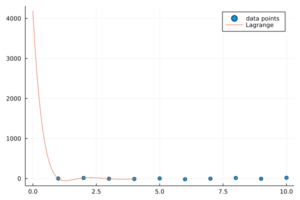
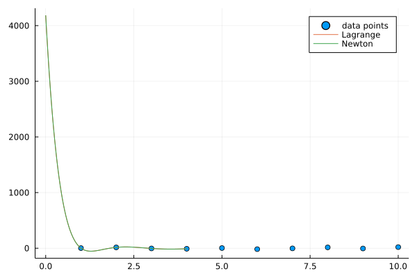
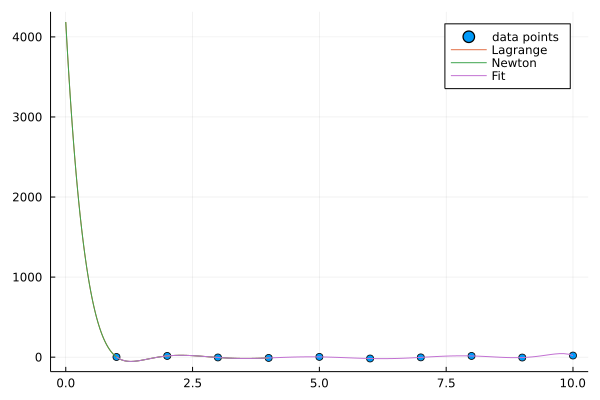
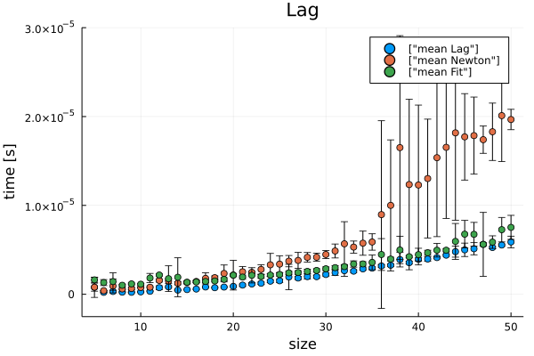
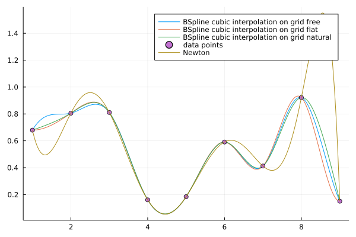

## Współczynik podpierdzialności [7/8]

- Powód Metoda Newtona nie zwraca obiektu interpolacyjnego

### Napisać własną implementację interpolacji wielomianowej stosując wprost wzór na wielomian interpolacyjny  Lagrange'a .  Przetestować swoją implementację na wylosowanych węzłach interpolacji w wybranym przedziale. Narysować wykres wielomianu interpolacyjnego w tym przedziale wraz z wezlami interpolacji. <b>(1 pkt)</b>


```julia
function interpolateLag(f::Vector{Vector{Float64}},x::Float64)
    result=0
    for point1 in f
        term=point1[2]
        for point2 in f
            if point1[1]!=point2[1] || point1[2]!=point2[2]
                term*=(x-point2[1])/(point1[1]-point2[1])
            end
        end
        result+=term
    end
    return result
end
```


    interpolateLag (generic function with 1 method)


```julia
using Plots
points=[[1.0,2.0],[2.0,15.0],[3.0,-4.0],[4.0,-10.0],[5.0,3.0],[6.0,-17.0],[7.0,-3.0],[8.0,15.0],[9.0,-5.0],[10.0,20.0]]
xs=Vector{Float64}(undef,0)
ys=Vector{Float64}(undef,0)
for i in points
    push!(xs,i[1])
    push!(ys,i[2])
end
scatter(xs, ys, label="data points")
1
```


    1


```julia
xsf=0:0.01:4
ysf=[interpolateLag(points,x) for x in xsf]
plot!(xsf,ysf,label="Lagrange")
```


    

    


### Zrobic to samo dla metody  Newtona (metoda ilorazów róznicowych).Narysować wykres wielomianu interpolacyjnego otrzymanego metodą Newtona dla tych samych danych, co w poprzednim punkcie. Zadbać o to, żeby ilorazy wyliczać tylko raz dla danego zbioru wezłow interpolacji, według schematu z pakietu Interpolations http://juliamath.github.io/Interpolations.jl/stable/interpolations/ : 
   1. napisać funkcję `NewtonInterpolation`, która wylicza ilorazy różnicowe i zwraca "obiekt interpolacyjny" `newt`
   2. napisać funkcję która wylicza wartość wielomianu dla obiektu `newt` w punkcie x za pomocą  <b>schematu Hornera dla postaci Newtona </b> <b>(2 pkt)</b>


```julia
function newtonTable(xi,fi)
    npts = length(xi)
    T = zeros(npts,npts)
    T[:,1] = fi
    for j=2:npts
        for i=j:npts
            T[i,j] = (T[i,j-1] - T[i-1,j-1])/(xi[i] - xi[i-j+1])
        end
    end
    return T
end
```


    newtonTable (generic function with 1 method)


```julia
function interpolateNewton(xx,xi,fi)
    T = newtonTable(xi,fi)
    xv = ones(size(xx))
    f = T[1,1] .* xv
    for i=2:size(T,1)
        xv = xv .* (xx .- xi[i-1])
        f += T[i,i] * xv
    end
    f
end
```


    interpolateNewton (generic function with 1 method)


```julia
ysf2=[interpolateNewton(x,xs,ys) for x in xsf]
plot!(xsf,ysf2,label="Newton")
```


    

    


### Zastosować interpolację wielomianową z pakietu Polynomials do tych samych danych, co w poprzednich punktach. Porównać wszystkie 3 wyniki interpolacji wielomianowej na jednym wykresie. Co zauważamy? Dlaczego? <b>(1 pkt)</b>


```julia
using Interpolations
using Polynomials

plot!(fit(xs,ys),extrema(xs)...,label="Fit")
```


    

    


### Porównać metody poprzez pomiar czasu wykonania dla zmiennej ilości węzłow interpolacji. Uwaga: dodatkowo, dla metody Newtona i pakietu Polynomials należy osobno zmierzyć czas wyliczania wielomianu i osobno czas wyliczania wartości w punkcie. Dokonać pomiaru 10 razy i policzyć wartość średnią oraz oszacować błąd pomiaru za pomocą odchylenia standardowego; wyniki przedstawić na wykresach. Jako narzędzie do analizy danych użyć Julia DataFrames <b>(2 pkt)</b>


```julia
using DataFrames
prev=DataFrame(Function=String[],Size=Int[],Time=Float64[])
function TimeLag(range::Int)
    points=[[x,log(x)] for x in 1:range]
    @elapsed interpolateLag(points,rand())
    for i in 1:range
        push!(prev,("Lag",range,@elapsed interpolateLag(points,rand())))
    end
end
function TimeNewton(range::Int)
    x=1:1:range
    y=[log(i) for i in x]
    @elapsed interpolateNewton(rand(),x,y)
    for i in 1:range
        push!(prev,("Newton",range,@elapsed interpolateNewton(rand(),x,y)))
    end
end
function TimeFit(range::Int)
    x=1:1:range
    y=[log(i) for i in x]
    @elapsed fit(x,y)
    for i in 1:range
        push!(prev,("Fit",range,@elapsed fit(x,y)))
    end
end
for i in 5:50
    TimeLag(i)
    TimeNewton(i)
    TimeFit(i)
end
prev
```


<div class="data-frame"><p>3,795 rows × 3 columns</p><table class="data-frame"><thead><tr><th></th><th>Function</th><th>Size</th><th>Time</th></tr><tr><th></th><th title="String">String</th><th title="Int64">Int64</th><th title="Float64">Float64</th></tr></thead><tbody><tr><th>1</th><td>Lag</td><td>5</td><td>3.0e-7</td></tr><tr><th>2</th><td>Lag</td><td>5</td><td>2.8e-6</td></tr><tr><th>3</th><td>Lag</td><td>5</td><td>4.0e-7</td></tr><tr><th>4</th><td>Lag</td><td>5</td><td>2.0e-7</td></tr><tr><th>5</th><td>Lag</td><td>5</td><td>2.0e-7</td></tr><tr><th>6</th><td>Newton</td><td>5</td><td>1.6e-6</td></tr><tr><th>7</th><td>Newton</td><td>5</td><td>7.0e-7</td></tr><tr><th>8</th><td>Newton</td><td>5</td><td>6.0e-7</td></tr><tr><th>9</th><td>Newton</td><td>5</td><td>6.0e-7</td></tr><tr><th>10</th><td>Newton</td><td>5</td><td>5.0e-7</td></tr><tr><th>11</th><td>Fit</td><td>5</td><td>2.1e-6</td></tr><tr><th>12</th><td>Fit</td><td>5</td><td>1.5e-6</td></tr><tr><th>13</th><td>Fit</td><td>5</td><td>1.5e-6</td></tr><tr><th>14</th><td>Fit</td><td>5</td><td>1.6e-6</td></tr><tr><th>15</th><td>Fit</td><td>5</td><td>1.4e-6</td></tr><tr><th>16</th><td>Lag</td><td>6</td><td>3.0e-7</td></tr><tr><th>17</th><td>Lag</td><td>6</td><td>2.0e-7</td></tr><tr><th>18</th><td>Lag</td><td>6</td><td>2.0e-7</td></tr><tr><th>19</th><td>Lag</td><td>6</td><td>2.0e-7</td></tr><tr><th>20</th><td>Lag</td><td>6</td><td>2.0e-7</td></tr><tr><th>21</th><td>Lag</td><td>6</td><td>2.0e-7</td></tr><tr><th>22</th><td>Newton</td><td>6</td><td>4.0e-7</td></tr><tr><th>23</th><td>Newton</td><td>6</td><td>4.0e-7</td></tr><tr><th>24</th><td>Newton</td><td>6</td><td>4.0e-7</td></tr><tr><th>25</th><td>Newton</td><td>6</td><td>4.0e-7</td></tr><tr><th>26</th><td>Newton</td><td>6</td><td>4.0e-7</td></tr><tr><th>27</th><td>Newton</td><td>6</td><td>4.0e-7</td></tr><tr><th>28</th><td>Fit</td><td>6</td><td>9.0e-7</td></tr><tr><th>29</th><td>Fit</td><td>6</td><td>1.1e-6</td></tr><tr><th>30</th><td>Fit</td><td>6</td><td>1.1e-6</td></tr><tr><th>&vellip;</th><td>&vellip;</td><td>&vellip;</td><td>&vellip;</td></tr></tbody></table></div>


```julia
using Statistics
gdf=groupby(prev,[:Function,:Size])
gdf=combine(gdf,:Time=>std,:Time=>mean)
```


<div class="data-frame"><p>138 rows × 4 columns</p><table class="data-frame"><thead><tr><th></th><th>Function</th><th>Size</th><th>Time_std</th><th>Time_mean</th></tr><tr><th></th><th title="String">String</th><th title="Int64">Int64</th><th title="Float64">Float64</th><th title="Float64">Float64</th></tr></thead><tbody><tr><th>1</th><td>Lag</td><td>5</td><td>1.13225e-6</td><td>7.8e-7</td></tr><tr><th>2</th><td>Newton</td><td>5</td><td>4.52769e-7</td><td>8.0e-7</td></tr><tr><th>3</th><td>Fit</td><td>5</td><td>2.77489e-7</td><td>1.62e-6</td></tr><tr><th>4</th><td>Lag</td><td>6</td><td>4.08248e-8</td><td>2.16667e-7</td></tr><tr><th>5</th><td>Newton</td><td>6</td><td>0.0</td><td>4.0e-7</td></tr><tr><th>6</th><td>Fit</td><td>6</td><td>3.37145e-7</td><td>1.31667e-6</td></tr><tr><th>7</th><td>Lag</td><td>7</td><td>1.21499e-7</td><td>3.14286e-7</td></tr><tr><th>8</th><td>Newton</td><td>7</td><td>7.73982e-7</td><td>9.28571e-7</td></tr><tr><th>9</th><td>Fit</td><td>7</td><td>9.77606e-7</td><td>1.42857e-6</td></tr><tr><th>10</th><td>Lag</td><td>8</td><td>5.17549e-8</td><td>2.375e-7</td></tr><tr><th>11</th><td>Newton</td><td>8</td><td>9.2582e-8</td><td>6.0e-7</td></tr><tr><th>12</th><td>Fit</td><td>8</td><td>1.12599e-7</td><td>1.0125e-6</td></tr><tr><th>13</th><td>Lag</td><td>9</td><td>4.40959e-8</td><td>2.22222e-7</td></tr><tr><th>14</th><td>Newton</td><td>9</td><td>1.23603e-7</td><td>6.44444e-7</td></tr><tr><th>15</th><td>Fit</td><td>9</td><td>1.0e-7</td><td>1.16667e-6</td></tr><tr><th>16</th><td>Lag</td><td>10</td><td>6.74949e-8</td><td>2.7e-7</td></tr><tr><th>17</th><td>Newton</td><td>10</td><td>6.99206e-8</td><td>7.6e-7</td></tr><tr><th>18</th><td>Fit</td><td>10</td><td>8.23273e-8</td><td>1.13e-6</td></tr><tr><th>19</th><td>Lag</td><td>11</td><td>5.04525e-8</td><td>3.36364e-7</td></tr><tr><th>20</th><td>Newton</td><td>11</td><td>8.31209e-8</td><td>7.90909e-7</td></tr><tr><th>21</th><td>Fit</td><td>11</td><td>5.1979e-7</td><td>1.82727e-6</td></tr><tr><th>22</th><td>Lag</td><td>12</td><td>2.15146e-7</td><td>7.41667e-7</td></tr><tr><th>23</th><td>Newton</td><td>12</td><td>1.83196e-7</td><td>1.55833e-6</td></tr><tr><th>24</th><td>Fit</td><td>12</td><td>1.30268e-7</td><td>2.16667e-6</td></tr><tr><th>25</th><td>Lag</td><td>13</td><td>1.03155e-7</td><td>8.30769e-7</td></tr><tr><th>26</th><td>Newton</td><td>13</td><td>2.70801e-7</td><td>1.5e-6</td></tr><tr><th>27</th><td>Fit</td><td>13</td><td>1.44834e-6</td><td>1.75385e-6</td></tr><tr><th>28</th><td>Lag</td><td>14</td><td>6.1125e-8</td><td>4.71429e-7</td></tr><tr><th>29</th><td>Newton</td><td>14</td><td>1.6968e-7</td><td>1.24286e-6</td></tr><tr><th>30</th><td>Fit</td><td>14</td><td>2.18944e-6</td><td>1.91429e-6</td></tr><tr><th>&vellip;</th><td>&vellip;</td><td>&vellip;</td><td>&vellip;</td><td>&vellip;</td></tr></tbody></table></div>


```julia
scatter(gdf[gdf.Function.=="Lag",:].Size,
    gdf[gdf.Function.=="Lag",:].Time_mean,
    yerr=gdf[gdf.Function.=="Lag",:].Time_std,
    label=["mean Lag"],
    xlabel="size",ylabel="time [s]",title="Lag")
scatter!(gdf[gdf.Function.=="Newton",:].Size,
    gdf[gdf.Function.=="Newton",:].Time_mean,
    yerr=gdf[gdf.Function.=="Newton",:].Time_std,
    label=["mean Newton"],
    xlabel="size",ylabel="time [s]",title="Lag")
scatter!(gdf[gdf.Function.=="Fit",:].Size,
    gdf[gdf.Function.=="Fit",:].Time_mean,
    yerr=gdf[gdf.Function.=="Fit",:].Time_std,
    label=["mean Fit"],
    xlabel="size",ylabel="time [s]",title="Lag")
```


    

    


### Zaimplementować algorytm Neville’a i sprawdzić (dla kilku wybranych punktów), czy daje te same wartości wielomianu co wybrana interpolacja wielomianowa.<b>(1 pkt)</b>


```julia
function interpolateNeville(x,y,value)
    len=length(x)
    A = zeros(len,len)
    for i in 1:len
        A[i,1]=y[i]
    end
    for i in 1:len-1
        for j in i:len-1
            A[j+1,i+1]=((value-x[j-i+1])*A[j+1,i]-(value-x[j+1])*A[j,i])/(x[j+1]-x[j-i+1])
        end
    end
    return A[len,len]
end
```


    interpolateNeville (generic function with 1 method)


```julia
print(interpolateNeville(xs,ys,2.5),"\n")
print(interpolateLag(points,2.5),"\n")
print(interpolateNewton(2.5,xs,ys))
```

    18.65771484375
    18.65771484375
    18.65771484375


```julia
print(interpolateNeville(xs,ys,5.5),"\n")
print(interpolateLag(points,5.5),"\n")
print(interpolateNewton(5.5,xs,ys))
```

    -6.39849853515625
    -6.398498535156251
    -6.398498535156249

### Poeksperymentować z  interpolacją funkcjami sklejanymi (minimum dwie różne funkcje sklejane),  narysować wykresy i porównać z wykresami interpolacji wielomianowej. <b>Zademonstrować  efekt Rungego</b> <b>(1 pkt)</b>. 


```julia
xData =  1:1:9
yData = [rand() for x in xData]
xsf = 1:0.01:9
itp = interpolate(yData, BSpline(Cubic(Free(OnGrid()))))
ysf3=[itp(x) for x in xsf]
plot(xsf,ysf3, label="BSpline cubic interpolation on grid free")
itp = interpolate(yData, BSpline(Cubic(Flat(OnGrid()))))
ysf3=[itp(x) for x in xsf]
plot!(xsf,ysf3, label="BSpline cubic interpolation on grid flat")
itp = interpolate(yData, BSpline(Cubic(Natural(OnGrid()))))
ysf3=[itp(x) for x in xsf]
plot!(xsf,ysf3, label="BSpline cubic interpolation on grid natural")

scatter!(xData,yData, label="data points")
ysf4=[interpolateNewton(x,xData,yData) for x in xsf]
plot!(xsf,ysf4,label="Newton")

```


    

    


