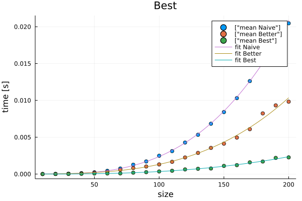
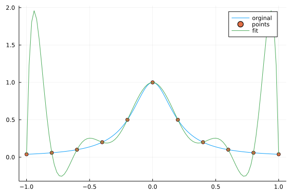
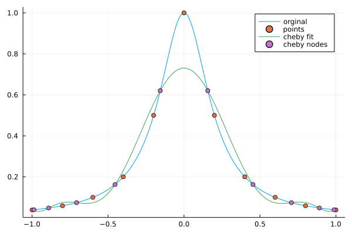

## Współczynik podpierdzialności [6/5]

### 1. Uruchomić 
   - `naive_multiplication(A,B)`, 
   - `better_multiplication(A,B)` 
   - mnożenie BLAS w Julii (`A*B`) 

dla coraz większych macierzy kwadratowych i zmierzyć czasy. Narysować wykres zależyności czasu od rozmiaru macierzy wraz z słupkami błędów, tak jak na poprzednim laboratorium. Wszystkie trzy metody powinny być na jednym wykresie. **(1pkt)**
 


```julia
function naive_multiplication(A,B)
    C = zeros(Float64, size(A,1), size(B,2))
    for i=1:size(A,1)
        for j=1:size(B,2)
            for k=1:size(A,2)
                C[i,j] = C[i,j] + A[i,k]*B[k,j]
            end
        end
    end
    C
end
```


    naive_multiplication (generic function with 1 method)


```julia
function better_multiplication(A, B)
    C = zeros(Float64, size(A,1), size(B,2))
    for j=1:size(B,2)
        for k=1:size(A,2)
            for i=1:size(A,1)
                C[i,j] = C[i,j] + A[i,k]*B[k,j]
            end
        end
    end
    C
end
```


    better_multiplication (generic function with 1 method)


```julia
function best_multiplication(A, B)
    A*B
end
```


    best_multiplication (generic function with 1 method)


```julia
using DataFrames
data=DataFrame(Function=String[],Size=Int[],Time=Float64[])
function TimeNaive(range::Int,size::Int)
    A=rand(-1:1:1,size,size)
    B=rand(-1:1:1,size,size)
    @elapsed naive_multiplication(A,B)
    for i in 1:range
        push!(data,("Naive",size,@elapsed naive_multiplication(A,B)))
    end
end
function TimeBetter(range::Int,size::Int)
    A=rand(-1:1:1,size,size)
    B=rand(-1:1:1,size,size)
    @elapsed better_multiplication(A, B)
    for i in 1:range
        push!(data,("Better",size,@elapsed better_multiplication(A, B)))
    end
end
function TimeBest(range::Int,size::Int)
    A=rand(-1:1:1,size,size)
    B=rand(-1:1:1,size,size)
    @elapsed best_multiplication(A, B)
    for i in 1:range
        push!(data,("Best",size,@elapsed best_multiplication(A, B)))
    end
end
r=100
for i in 10:10:200
    TimeNaive(r,i)
    TimeBetter(r,i)
    TimeBest(r,i)
end
data
using CSV
CSV.write("data_lab4.csv",data)
```


    "data_lab4.csv"


```julia
using Statistics
gdf=groupby(data,[:Function,:Size])
gdf=combine(gdf,:Time=>std,:Time=>mean)
```


<div class="data-frame"><p>60 rows × 4 columns</p><table class="data-frame"><thead><tr><th></th><th>Function</th><th>Size</th><th>Time_std</th><th>Time_mean</th></tr><tr><th></th><th title="String">String</th><th title="Int64">Int64</th><th title="Float64">Float64</th><th title="Float64">Float64</th></tr></thead><tbody><tr><th>1</th><td>Naive</td><td>10</td><td>1.77009e-7</td><td>1.391e-6</td></tr><tr><th>2</th><td>Better</td><td>10</td><td>1.07757e-6</td><td>1.384e-6</td></tr><tr><th>3</th><td>Best</td><td>10</td><td>1.1085e-6</td><td>1.403e-6</td></tr><tr><th>4</th><td>Naive</td><td>20</td><td>2.27997e-6</td><td>1.249e-5</td></tr><tr><th>5</th><td>Better</td><td>20</td><td>1.2959e-5</td><td>1.2719e-5</td></tr><tr><th>6</th><td>Best</td><td>20</td><td>1.53848e-5</td><td>5.162e-6</td></tr><tr><th>7</th><td>Naive</td><td>30</td><td>1.72053e-5</td><td>5.1258e-5</td></tr><tr><th>8</th><td>Better</td><td>30</td><td>5.60183e-6</td><td>3.9312e-5</td></tr><tr><th>9</th><td>Best</td><td>30</td><td>6.59618e-6</td><td>1.1884e-5</td></tr><tr><th>10</th><td>Naive</td><td>40</td><td>2.04771e-5</td><td>0.000120287</td></tr><tr><th>11</th><td>Better</td><td>40</td><td>1.20485e-5</td><td>8.8548e-5</td></tr><tr><th>12</th><td>Best</td><td>40</td><td>2.03562e-5</td><td>3.2164e-5</td></tr><tr><th>13</th><td>Naive</td><td>50</td><td>3.83515e-5</td><td>0.000235933</td></tr><tr><th>14</th><td>Better</td><td>50</td><td>4.01827e-5</td><td>0.000176226</td></tr><tr><th>15</th><td>Best</td><td>50</td><td>2.51104e-5</td><td>7.5297e-5</td></tr><tr><th>16</th><td>Naive</td><td>60</td><td>7.39219e-5</td><td>0.000436027</td></tr><tr><th>17</th><td>Better</td><td>60</td><td>5.74862e-5</td><td>0.000291159</td></tr><tr><th>18</th><td>Best</td><td>60</td><td>1.91769e-5</td><td>7.807e-5</td></tr><tr><th>19</th><td>Naive</td><td>70</td><td>0.000111814</td><td>0.000749922</td></tr><tr><th>20</th><td>Better</td><td>70</td><td>0.000979915</td><td>0.000582816</td></tr><tr><th>21</th><td>Best</td><td>70</td><td>2.42709e-6</td><td>8.9955e-5</td></tr><tr><th>22</th><td>Naive</td><td>80</td><td>0.000288044</td><td>0.00126629</td></tr><tr><th>23</th><td>Better</td><td>80</td><td>0.000225746</td><td>0.000812609</td></tr><tr><th>24</th><td>Best</td><td>80</td><td>4.90906e-5</td><td>0.000188227</td></tr><tr><th>25</th><td>Naive</td><td>90</td><td>0.000208459</td><td>0.00171221</td></tr><tr><th>26</th><td>Better</td><td>90</td><td>0.000245859</td><td>0.00102369</td></tr><tr><th>27</th><td>Best</td><td>90</td><td>8.42935e-5</td><td>0.00025577</td></tr><tr><th>28</th><td>Naive</td><td>100</td><td>0.000764567</td><td>0.0024846</td></tr><tr><th>29</th><td>Better</td><td>100</td><td>0.000151052</td><td>0.00130644</td></tr><tr><th>30</th><td>Best</td><td>100</td><td>9.16655e-5</td><td>0.000349363</td></tr><tr><th>&vellip;</th><td>&vellip;</td><td>&vellip;</td><td>&vellip;</td><td>&vellip;</td></tr></tbody></table></div>


```julia
using Plots
scatter(gdf[gdf.Function.=="Naive",:].Size,
    gdf[gdf.Function.=="Naive",:].Time_mean,
    yerr=gdf[gdf.Function.=="Naive",:].Time_std,
    label=["mean Naive"],
    xlabel="size",ylabel="time [s]",title="Naive")
scatter!(gdf[gdf.Function.=="Better",:].Size,
    gdf[gdf.Function.=="Better",:].Time_mean,
    yerr=gdf[gdf.Function.=="Better",:].Time_std,
    label=["mean Better"],
    xlabel="size",ylabel="time [s]",title="Better")
scatter!(gdf[gdf.Function.=="Best",:].Size,
    gdf[gdf.Function.=="Best",:].Time_mean,
    yerr=gdf[gdf.Function.=="Best",:].Time_std,
    label=["mean Best"],
    xlabel="size",ylabel="time [s]",title="Best")
```


    

    


### 2. Napisać w języku C:
   - naiwną metodę mnożenia macierzy kwadratowych (wersja 1) 
   - ulepszoną wersję za pomocą zamiany pętli metodę mnożenia macierzy(wersja 2), pamiętając, że w C macierz przechowywana jest wierszami (row major order tzn A11,A12, ..., A1m, A21, A22,...,A2m, ..Anm), inaczej niż w Julii ! 
   - skorzystać z  możliwości BLAS poziom 3 dostępnego w GSL  (przykład uzycia https://www.gnu.org/software/gsl/doc/html/blas.html#examples )
    
Należy porównywać działanie tych trzech algorytmow bez włączonej opcji optymalizacji kompilatora. Przedstawić wyniki na jednym wykresie tak jak w p.1. (osobno niż p.1). **(1 pkt)**
    
*(Dla chętnych)* sprawdzić, co się dzieje, jak włączymy optymalizację kompilatora i dodać do wykresu. 


```julia
data2=DataFrame(CSV.File("raport.csv"))

```


<div class="data-frame"><p>24,000 rows × 3 columns</p><table class="data-frame"><thead><tr><th></th><th>Function</th><th>Size</th><th>Time</th></tr><tr><th></th><th title="String15">String15</th><th title="Int64">Int64</th><th title="Float64">Float64</th></tr></thead><tbody><tr><th>1</th><td>naive O0</td><td>10</td><td>0.0</td></tr><tr><th>2</th><td>better O0</td><td>10</td><td>0.0</td></tr><tr><th>3</th><td>best O0</td><td>10</td><td>0.0</td></tr><tr><th>4</th><td>naive O0</td><td>10</td><td>0.0</td></tr><tr><th>5</th><td>better O0</td><td>10</td><td>0.0</td></tr><tr><th>6</th><td>best O0</td><td>10</td><td>0.0</td></tr><tr><th>7</th><td>naive O0</td><td>10</td><td>0.0</td></tr><tr><th>8</th><td>better O0</td><td>10</td><td>0.0</td></tr><tr><th>9</th><td>best O0</td><td>10</td><td>0.0</td></tr><tr><th>10</th><td>naive O0</td><td>10</td><td>0.0</td></tr><tr><th>11</th><td>better O0</td><td>10</td><td>0.0</td></tr><tr><th>12</th><td>best O0</td><td>10</td><td>0.0</td></tr><tr><th>13</th><td>naive O0</td><td>10</td><td>0.0</td></tr><tr><th>14</th><td>better O0</td><td>10</td><td>0.0</td></tr><tr><th>15</th><td>best O0</td><td>10</td><td>0.0</td></tr><tr><th>16</th><td>naive O0</td><td>10</td><td>0.0</td></tr><tr><th>17</th><td>better O0</td><td>10</td><td>0.0</td></tr><tr><th>18</th><td>best O0</td><td>10</td><td>0.0</td></tr><tr><th>19</th><td>naive O0</td><td>10</td><td>0.0</td></tr><tr><th>20</th><td>better O0</td><td>10</td><td>0.0</td></tr><tr><th>21</th><td>best O0</td><td>10</td><td>0.0</td></tr><tr><th>22</th><td>naive O0</td><td>10</td><td>0.0</td></tr><tr><th>23</th><td>better O0</td><td>10</td><td>0.0</td></tr><tr><th>24</th><td>best O0</td><td>10</td><td>0.0</td></tr><tr><th>25</th><td>naive O0</td><td>10</td><td>0.0</td></tr><tr><th>26</th><td>better O0</td><td>10</td><td>0.0</td></tr><tr><th>27</th><td>best O0</td><td>10</td><td>0.0</td></tr><tr><th>28</th><td>naive O0</td><td>10</td><td>0.0</td></tr><tr><th>29</th><td>better O0</td><td>10</td><td>0.0</td></tr><tr><th>30</th><td>best O0</td><td>10</td><td>0.0</td></tr><tr><th>&vellip;</th><td>&vellip;</td><td>&vellip;</td><td>&vellip;</td></tr></tbody></table></div>


```julia
gdf2=groupby(data2,[:Function,:Size])
gdf2=combine(gdf2,:Time=>std,:Time=>mean)
```


<div class="data-frame"><p>240 rows × 4 columns</p><table class="data-frame"><thead><tr><th></th><th>Function</th><th>Size</th><th>Time_std</th><th>Time_mean</th></tr><tr><th></th><th title="String15">String15</th><th title="Int64">Int64</th><th title="Float64">Float64</th><th title="Float64">Float64</th></tr></thead><tbody><tr><th>1</th><td>naive O0</td><td>10</td><td>0.0</td><td>0.0</td></tr><tr><th>2</th><td>naive O0</td><td>20</td><td>0.0</td><td>0.0</td></tr><tr><th>3</th><td>naive O0</td><td>30</td><td>0.001</td><td>0.0001</td></tr><tr><th>4</th><td>naive O0</td><td>40</td><td>0.00140705</td><td>0.0002</td></tr><tr><th>5</th><td>naive O0</td><td>50</td><td>0.00219043</td><td>0.0005</td></tr><tr><th>6</th><td>naive O0</td><td>60</td><td>0.00256432</td><td>0.0007</td></tr><tr><th>7</th><td>naive O0</td><td>70</td><td>0.00314466</td><td>0.0011</td></tr><tr><th>8</th><td>naive O0</td><td>80</td><td>0.00386123</td><td>0.0018</td></tr><tr><th>9</th><td>naive O0</td><td>90</td><td>0.00446196</td><td>0.0027</td></tr><tr><th>10</th><td>naive O0</td><td>100</td><td>0.00460566</td><td>0.003</td></tr><tr><th>11</th><td>naive O0</td><td>110</td><td>0.00502117</td><td>0.0052</td></tr><tr><th>12</th><td>naive O0</td><td>120</td><td>0.00510397</td><td>0.0061</td></tr><tr><th>13</th><td>naive O0</td><td>130</td><td>0.00422953</td><td>0.0077</td></tr><tr><th>14</th><td>naive O0</td><td>140</td><td>0.00293189</td><td>0.0093</td></tr><tr><th>15</th><td>naive O0</td><td>150</td><td>0.004</td><td>0.0104</td></tr><tr><th>16</th><td>naive O0</td><td>160</td><td>0.0049757</td><td>0.0157</td></tr><tr><th>17</th><td>naive O0</td><td>170</td><td>0.00464823</td><td>0.0169</td></tr><tr><th>18</th><td>naive O0</td><td>180</td><td>0.00261116</td><td>0.0205</td></tr><tr><th>19</th><td>naive O0</td><td>190</td><td>0.00494311</td><td>0.0259</td></tr><tr><th>20</th><td>naive O0</td><td>200</td><td>0.00586033</td><td>0.028</td></tr><tr><th>21</th><td>better O0</td><td>10</td><td>0.0</td><td>0.0</td></tr><tr><th>22</th><td>better O0</td><td>20</td><td>0.001</td><td>0.0001</td></tr><tr><th>23</th><td>better O0</td><td>30</td><td>0.00140705</td><td>0.0002</td></tr><tr><th>24</th><td>better O0</td><td>40</td><td>0.00140705</td><td>0.0002</td></tr><tr><th>25</th><td>better O0</td><td>50</td><td>0.00196946</td><td>0.0004</td></tr><tr><th>26</th><td>better O0</td><td>60</td><td>0.00287623</td><td>0.0009</td></tr><tr><th>27</th><td>better O0</td><td>70</td><td>0.00348735</td><td>0.0014</td></tr><tr><th>28</th><td>better O0</td><td>80</td><td>0.00402015</td><td>0.002</td></tr><tr><th>29</th><td>better O0</td><td>90</td><td>0.00440844</td><td>0.0026</td></tr><tr><th>30</th><td>better O0</td><td>100</td><td>0.00494311</td><td>0.0041</td></tr><tr><th>&vellip;</th><td>&vellip;</td><td>&vellip;</td><td>&vellip;</td><td>&vellip;</td></tr></tbody></table></div>


```c
#include <stdio.h>
#include <gsl/gsl_ieee_utils.h>
#include <gsl/gsl_blas.h>
#include <stdlib.h>
#include <sys/times.h>
#include <unistd.h>

clock_t startTime,endTime;
struct tms timerStartTms,timerEndTms;
void startTimer(){
    startTime = times(&timerStartTms);
}
void endTimer(){
    endTime=times(&timerEndTms);
}
void printToFile(char* f,int size){
    double realTime=(double)(endTime-startTime)/sysconf(_SC_CLK_TCK);
    printf("%s,%d,%f\n",f,size,realTime);
}

void naive(int size,double A[size][size],double B[size][size]){
    double C[size][size];
    for(int i=0;i<size;i++){
        for(int j=0;j<size;j++){
            C[i][j]=0;
        }
    }
    for(int i=0;i<size;i++){
        for(int j=0;j<size;j++){
            for(int k=0;k<size;k++){
                C[i][j]+=A[i][k]*B[k][j];
            }
        }
    }
}

void better(double A[],double B[],int size){
    int C[size*size];
    for(int index=0;index<size*size;index++){
        C[index]=0;
    }
    for(int j=0;j<size;j++){
        for(int k=0;k<size;k++){
            for(int i=0;i<size;i++){
                C[i+j*size]+=A[i+k*size]*B[k+j*size];
            }
        }
    }
}
void best(double a[],double b[],int size){
    double c[size*size];
    for(int index=0;index<size*size;index++){
        c[index]=0;
    }
    gsl_matrix_view A= gsl_matrix_view_array(a,size,size);
    gsl_matrix_view B= gsl_matrix_view_array(b,size,size);
    gsl_matrix_view C= gsl_matrix_view_array(c,size,size);

    gsl_blas_dgemm(CblasNoTrans,CblasNoTrans,1.0,&A.matrix,&B.matrix,0.0,&C.matrix);
}

int main (void)
{
    for(int i=10;i<=200;i+=10){
        double array[i*i];
        double array2[i][i];
        for(int index=0;index<i*i;index++){
            array[index]=rand()%2;
        }
        for(int m=0;m<i;m++){
            for(int n=0;n<i;n++){
                array2[m][n]=rand()%2;
            }
        }
        for(int j=0;j<100;j++){
            startTimer();
            naive(i,array2,array2);
            endTimer();
            printToFile("naive O3",i);
            startTimer();
            better(array,array,i);
            endTimer();
            printToFile("better O3",i);
            startTimer();
            best(array,array,i);
            endTimer();
            printToFile("best O3",i);
        }
    }

}
```


```julia
using Plots
scatter(gdf2[gdf2.Function.=="naive O0",:].Size,
    gdf2[gdf2.Function.=="naive O0",:].Time_mean,
    yerr=gdf2[gdf2.Function.=="naive O0",:].Time_std,
    label=["mean naive O0"],
    xlabel="size",ylabel="time [s]",title="naive O0")
scatter!(gdf2[gdf2.Function.=="better O0",:].Size,
    gdf2[gdf2.Function.=="better O0",:].Time_mean,
    yerr=gdf2[gdf2.Function.=="better O0",:].Time_std,
    label=["mean better O0"],
    xlabel="size",ylabel="time [s]",title="better O0")
scatter!(gdf2[gdf2.Function.=="best O0",:].Size,
    gdf2[gdf2.Function.=="best O0",:].Time_mean,
    yerr=gdf2[gdf2.Function.=="best O0",:].Time_std,
    label=["mean best O0"],
    xlabel="size",ylabel="time [s]",title="best O0")
```


    

    


```julia
using Plots
scatter(gdf2[gdf2.Function.=="naive O1",:].Size,
    gdf2[gdf2.Function.=="naive O1",:].Time_mean,
    yerr=gdf2[gdf2.Function.=="naive O1",:].Time_std,
    label=["mean naive O1"],
    xlabel="size",ylabel="time [s]",title="naive O1")
scatter!(gdf2[gdf2.Function.=="better O1",:].Size,
    gdf2[gdf2.Function.=="better O1",:].Time_mean,
    yerr=gdf2[gdf2.Function.=="better O1",:].Time_std,
    label=["mean better O1"],
    xlabel="size",ylabel="time [s]",title="better O1")
scatter!(gdf2[gdf2.Function.=="best O1",:].Size,
    gdf2[gdf2.Function.=="best O1",:].Time_mean,
    yerr=gdf2[gdf2.Function.=="best O1",:].Time_std,
    label=["mean best O1"],
    xlabel="size",ylabel="time [s]",title="best O1")
```


    

    


```julia
using Plots
scatter(gdf2[gdf2.Function.=="naive O2",:].Size,
    gdf2[gdf2.Function.=="naive O2",:].Time_mean,
    yerr=gdf2[gdf2.Function.=="naive O2",:].Time_std,
    label=["mean naive O2"],
    xlabel="size",ylabel="time [s]",title="naive O2")
scatter!(gdf2[gdf2.Function.=="better O2",:].Size,
    gdf2[gdf2.Function.=="better O2",:].Time_mean,
    yerr=gdf2[gdf2.Function.=="better O2",:].Time_std,
    label=["mean better O2"],
    xlabel="size",ylabel="time [s]",title="better O2")
scatter!(gdf2[gdf2.Function.=="best O2",:].Size,
    gdf2[gdf2.Function.=="best O2",:].Time_mean,
    yerr=gdf2[gdf2.Function.=="best O2",:].Time_std,
    label=["mean best O2"],
    xlabel="size",ylabel="time [s]",title="best O2")
```


    

    


```julia
using Plots
scatter(gdf2[gdf2.Function.=="naive O3",:].Size,
    gdf2[gdf2.Function.=="naive O3",:].Time_mean,
    yerr=gdf2[gdf2.Function.=="naive O3",:].Time_std,
    label=["mean naive O3"],
    xlabel="size",ylabel="time [s]",title="naive O3")
scatter!(gdf2[gdf2.Function.=="better O3",:].Size,
    gdf2[gdf2.Function.=="better O3",:].Time_mean,
    yerr=gdf2[gdf2.Function.=="better O3",:].Time_std,
    label=["mean better O3"],
    xlabel="size",ylabel="time [s]",title="better O3")
scatter!(gdf2[gdf2.Function.=="best O3",:].Size,
    gdf2[gdf2.Function.=="best O3",:].Time_mean,
    yerr=gdf2[gdf2.Function.=="best O3",:].Time_std,
    label=["mean best O3"],
    xlabel="size",ylabel="time [s]",title="best O3")
```


    

    


### 3. Użyć funkcji `polyfit` z pakietu  Polynomials do znalezienia odpowiednich wielomianów, które najlepiej pasują do zależności czasowych każdego z algorytmów. Stopień wielomianu powinien zgadzać się z teoretyczną złożonoscią. Dodać wykresy uzyskanych wielomianów do wcześniejszych wykresów. **(1 pkt)**


```julia
using Polynomials
fNaive=fit(gdf[gdf.Function.=="Naive",:].Size,gdf[gdf.Function.=="Naive",:].Time_mean,3)
fBetter=fit(gdf[gdf.Function.=="Better",:].Size,gdf[gdf.Function.=="Better",:].Time_mean,3)
fBest=fit(gdf[gdf.Function.=="Best",:].Size,gdf[gdf.Function.=="Best",:].Time_mean,3)
f2Naive=fit(gdf2[gdf2.Function.=="naive O0",:].Size,gdf2[gdf2.Function.=="naive O0",:].Time_mean,3)
f2Better=fit(gdf2[gdf2.Function.=="better O0",:].Size,gdf2[gdf2.Function.=="better O0",:].Time_mean,3)
f2Best=fit(gdf2[gdf2.Function.=="best O0",:].Size,gdf2[gdf2.Function.=="best O0",:].Time_mean,3)
```


&#45;7.440660474716212e-5 &#43; 5.513761152474327e-6&#8729;x &#45; 8.95790394377018e-8&#8729;x<sup>2</sup> &#43; 7.28308798035546e-10&#8729;x<sup>3</sup>


```julia
scatter(gdf[gdf.Function.=="Naive",:].Size,
    gdf[gdf.Function.=="Naive",:].Time_mean,
    label=["mean Naive"],
    xlabel="size",ylabel="time [s]",title="Naive")
scatter!(gdf[gdf.Function.=="Better",:].Size,
    gdf[gdf.Function.=="Better",:].Time_mean,
    label=["mean Better"],
    xlabel="size",ylabel="time [s]",title="Better")
scatter!(gdf[gdf.Function.=="Best",:].Size,
    gdf[gdf.Function.=="Best",:].Time_mean,
    label=["mean Best"],
    xlabel="size",ylabel="time [s]",title="Best")
plot!(fNaive,extrema(gdf[gdf.Function.=="Naive",:].Size)...,label="fit Naive")
plot!(fBetter,extrema(gdf[gdf.Function.=="Better",:].Size)...,label="fit Better")
plot!(fBest,extrema(gdf[gdf.Function.=="Best",:].Size)...,label="fit Best")
```


    

    


```julia
using Plots
scatter(gdf2[gdf2.Function.=="naive O0",:].Size,
    gdf2[gdf2.Function.=="naive O0",:].Time_mean,
    label=["mean naive O0"],
    xlabel="size",ylabel="time [s]",title="naive O0")
scatter!(gdf2[gdf2.Function.=="better O0",:].Size,
    gdf2[gdf2.Function.=="better O0",:].Time_mean,
    label=["mean better O0"],
    xlabel="size",ylabel="time [s]",title="better O0")
scatter!(gdf2[gdf2.Function.=="best O0",:].Size,
    gdf2[gdf2.Function.=="best O0",:].Time_mean,
    label=["mean best O0"],
    xlabel="size",ylabel="time [s]",title="best O0")
plot!(f2Naive,extrema(gdf2[gdf2.Function.=="naive O0",:].Size)...,label="fit Naive")
plot!(f2Better,extrema(gdf2[gdf2.Function.=="better O0",:].Size)...,label="fit Better")
plot!(f2Best,extrema(gdf2[gdf2.Function.=="best O0",:].Size)...,label="fit Best")
```


    

    


### 4. Pokazać zniwelowanie efektu Rungego (przy interpolacji) poprzez użycie wsparcia dla wielomianów Czebyszewa w pakiecie Polynomials. Narysować wybraną funkcję z zaznaczonymi węzłami i wielomianem interpolacyjnym dla węzłów równoodległych oraz Czebyszewa (2 wykresy).**(1 pkt)**


```julia
f(x)=1/(1+25*x^2)
x=-1:0.001:1
plot(x,f.(x),label="orginal")

xs= -1:0.2:1
ys=[f(x) for x in xs]
scatter!(xs,ys,label="points")
fun=fit(xs,ys)
plot!(fun,extrema(xs)...,label="fit")
```


    

    


```julia
using ChebyshevApprox

cheby_base=[0,0,0,0,0,0,0,0,0,0,1]
cheby_poly=ChebyshevT(cheby_base)
args=Polynomials.roots(cheby_poly)
values=[f(x) for x in args]


plot(x,f.(x),label="orginal")
scatter!(xs,ys,label="points")
fun=fit(args,values)
plot!(fun,extrema(args)...,label="cheby fit")
scatter!(args,values,label="cheby nodes")
```


    

    


### 5. Przybliżenie Pade jest często lepsze niż rozwinięcie w szereg Taylora przy aproksymowaniu funkcji, które posiadają osobliwości. Korzystając ze wsparcia dla aproksymacji Pade w pakiecie Polynomials pokazać dowolny przykład (wraz z wykresem), gdzie takie przybliżenie faktycznie jest lepsze. Można odtworzyć wykres z wykładu albo zainspirować się przykładowym artykułem https://www.hindawi.com/journals/ijcm/2014/587430/ **(1 pkt)**


```julia
using TaylorSeries

f(x)=log(1+x)/x

taylor=Taylor1(Float64,5)
taylor_fun=f(taylor)
taylor_poly=Polynomial(taylor_fun.coeffs)

xs=0:0.1:3
ys=[f(x) for x in xs]

scatter(xs,ys,label="f points")
plot!(taylor_poly,extrema(xs)...,label="Taylor fit")

pade_object=Polynomials.PolyCompat.PadeApproximation.Pade(taylor_poly,2,2)
pade_poly(x)=pade_object.p(x)/pade_object.q(x)
plot!(pade_poly,extrema(xs)...,label="Pade")
```


    

    


