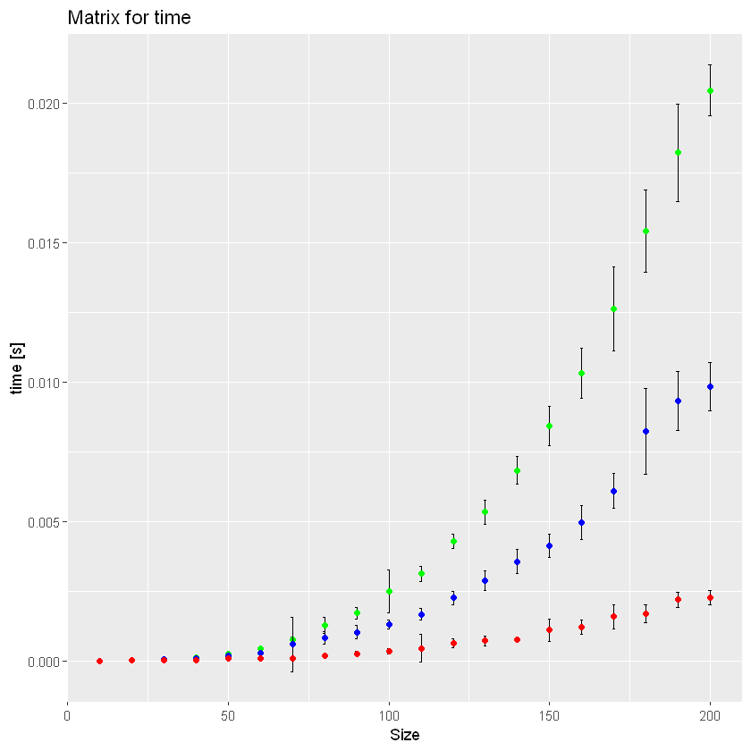
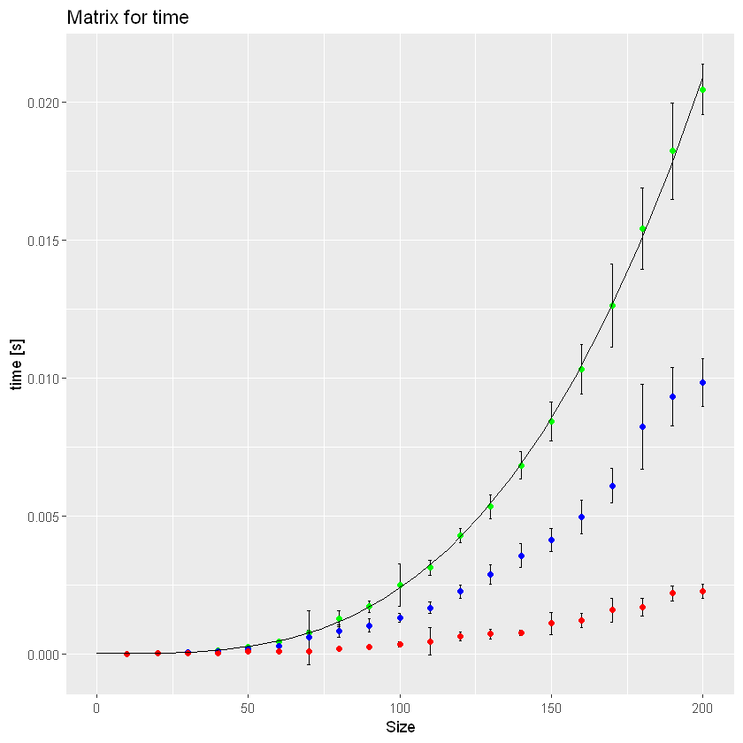
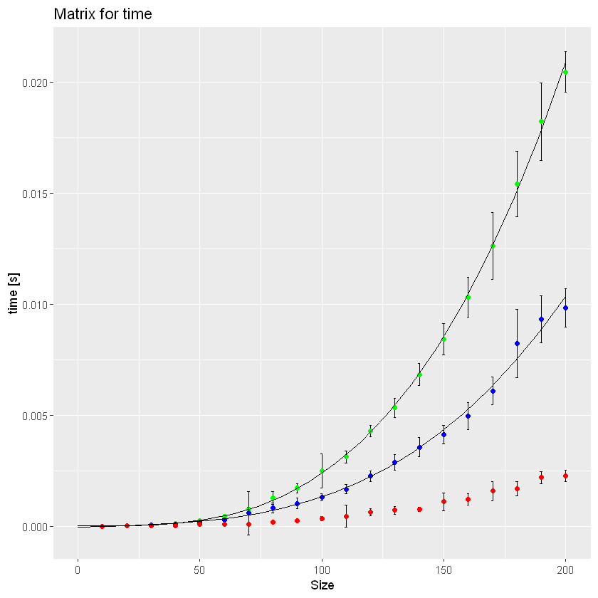
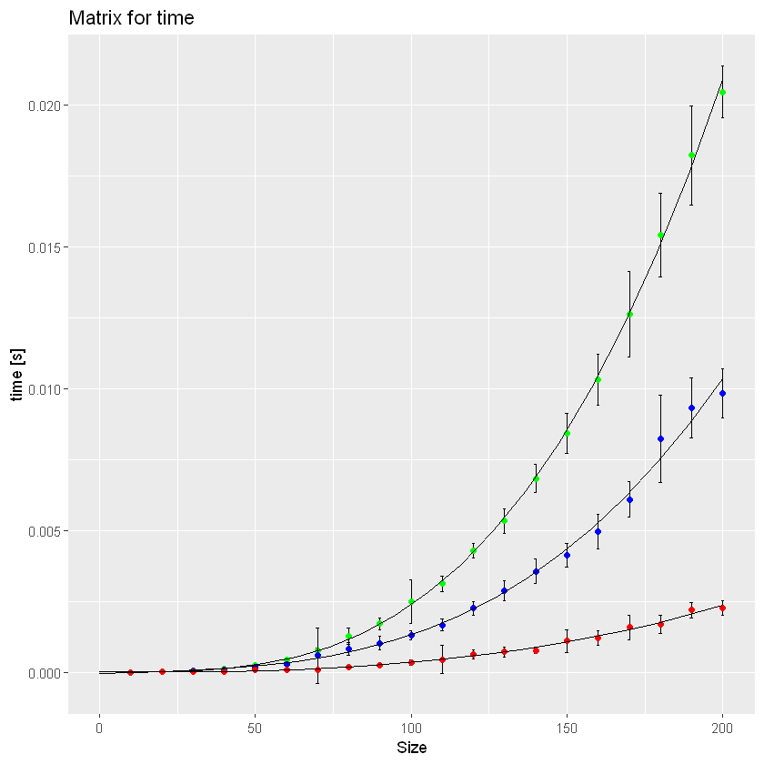
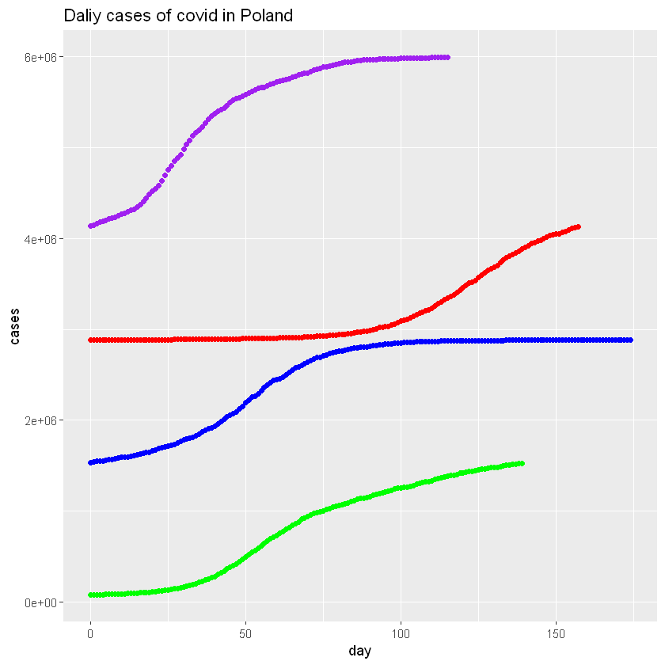
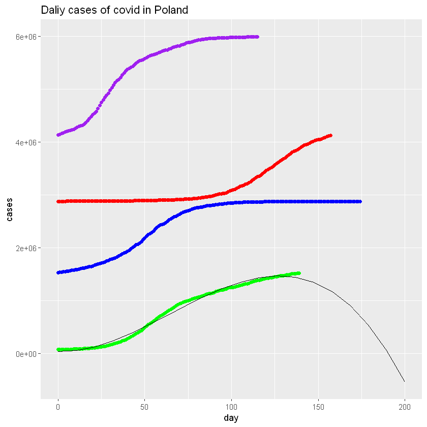
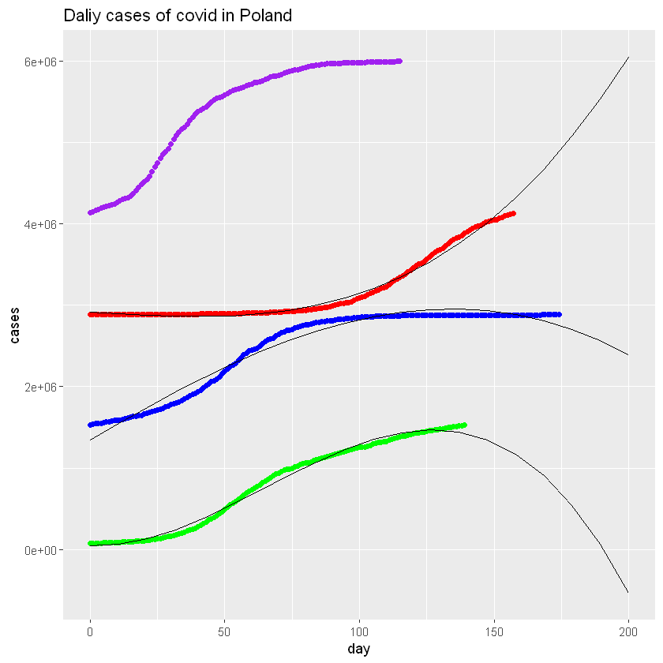
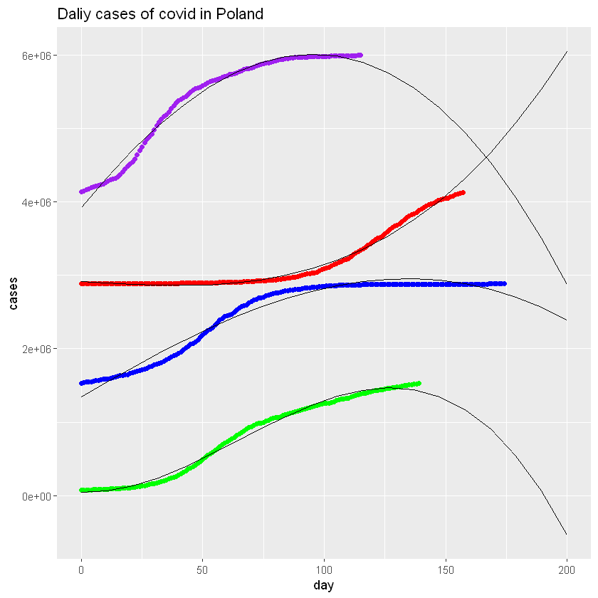

## Współczynik podpierdzialności [5/6]

- Powód zad 5 nie zostało wykonane za pomocą krzywej wykładniczej

### 2. W jednej tabeli języka R należy umieścić wyniki dwóch różnych eksperymentów (t.j. czas działania dwóch różnych funkcji) dla różnych parametrów (t.j. rozmiarów wektora(macierzy)). Tabela powinna zawierać dane z 10-krotnego uruchomienia tego samego eksperymentu dla tych samych parametrów (dla każdego takiego zestawu)  **(1p.)**


```R
data=read.csv("data_lab4.csv")
data
```


<table>
<thead><tr><th scope=col>Function</th><th scope=col>Size</th><th scope=col>Time</th></tr></thead>
<tbody>
	<tr><td>Naive  </td><td>10     </td><td>1.6e-06</td></tr>
	<tr><td>Naive  </td><td>10     </td><td>2.9e-06</td></tr>
	<tr><td>Naive  </td><td>10     </td><td>1.4e-06</td></tr>
	<tr><td>Naive  </td><td>10     </td><td>1.3e-06</td></tr>
	<tr><td>Naive  </td><td>10     </td><td>1.5e-06</td></tr>
	<tr><td>Naive  </td><td>10     </td><td>1.3e-06</td></tr>
	<tr><td>Naive  </td><td>10     </td><td>1.3e-06</td></tr>
	<tr><td>Naive  </td><td>10     </td><td>1.3e-06</td></tr>
	<tr><td>Naive  </td><td>10     </td><td>1.3e-06</td></tr>
	<tr><td>Naive  </td><td>10     </td><td>1.3e-06</td></tr>
	<tr><td>Naive  </td><td>10     </td><td>1.6e-06</td></tr>
	<tr><td>Naive  </td><td>10     </td><td>1.5e-06</td></tr>
	<tr><td>Naive  </td><td>10     </td><td>1.3e-06</td></tr>
	<tr><td>Naive  </td><td>10     </td><td>1.3e-06</td></tr>
	<tr><td>Naive  </td><td>10     </td><td>1.3e-06</td></tr>
	<tr><td>Naive  </td><td>10     </td><td>1.4e-06</td></tr>
	<tr><td>Naive  </td><td>10     </td><td>1.4e-06</td></tr>
	<tr><td>Naive  </td><td>10     </td><td>1.4e-06</td></tr>
	<tr><td>Naive  </td><td>10     </td><td>1.6e-06</td></tr>
	<tr><td>Naive  </td><td>10     </td><td>1.3e-06</td></tr>
	<tr><td>Naive  </td><td>10     </td><td>1.3e-06</td></tr>
	<tr><td>Naive  </td><td>10     </td><td>1.3e-06</td></tr>
	<tr><td>Naive  </td><td>10     </td><td>1.3e-06</td></tr>
	<tr><td>Naive  </td><td>10     </td><td>1.4e-06</td></tr>
	<tr><td>Naive  </td><td>10     </td><td>1.3e-06</td></tr>
	<tr><td>Naive  </td><td>10     </td><td>1.3e-06</td></tr>
	<tr><td>Naive  </td><td>10     </td><td>1.6e-06</td></tr>
	<tr><td>Naive  </td><td>10     </td><td>1.4e-06</td></tr>
	<tr><td>Naive  </td><td>10     </td><td>1.3e-06</td></tr>
	<tr><td>Naive  </td><td>10     </td><td>1.4e-06</td></tr>
	<tr><td>...</td><td>...</td><td>...</td></tr>
	<tr><td>Best     </td><td>200      </td><td>0.0028871</td></tr>
	<tr><td>Best     </td><td>200      </td><td>0.0023562</td></tr>
	<tr><td>Best     </td><td>200      </td><td>0.0019976</td></tr>
	<tr><td>Best     </td><td>200      </td><td>0.0020030</td></tr>
	<tr><td>Best     </td><td>200      </td><td>0.0020009</td></tr>
	<tr><td>Best     </td><td>200      </td><td>0.0020094</td></tr>
	<tr><td>Best     </td><td>200      </td><td>0.0019914</td></tr>
	<tr><td>Best     </td><td>200      </td><td>0.0022258</td></tr>
	<tr><td>Best     </td><td>200      </td><td>0.0025752</td></tr>
	<tr><td>Best     </td><td>200      </td><td>0.0021686</td></tr>
	<tr><td>Best     </td><td>200      </td><td>0.0020013</td></tr>
	<tr><td>Best     </td><td>200      </td><td>0.0020003</td></tr>
	<tr><td>Best     </td><td>200      </td><td>0.0020027</td></tr>
	<tr><td>Best     </td><td>200      </td><td>0.0020074</td></tr>
	<tr><td>Best     </td><td>200      </td><td>0.0021664</td></tr>
	<tr><td>Best     </td><td>200      </td><td>0.0021694</td></tr>
	<tr><td>Best     </td><td>200      </td><td>0.0024257</td></tr>
	<tr><td>Best     </td><td>200      </td><td>0.0020037</td></tr>
	<tr><td>Best     </td><td>200      </td><td>0.0019971</td></tr>
	<tr><td>Best     </td><td>200      </td><td>0.0020156</td></tr>
	<tr><td>Best     </td><td>200      </td><td>0.0034106</td></tr>
	<tr><td>Best     </td><td>200      </td><td>0.0027717</td></tr>
	<tr><td>Best     </td><td>200      </td><td>0.0022326</td></tr>
	<tr><td>Best     </td><td>200      </td><td>0.0025207</td></tr>
	<tr><td>Best     </td><td>200      </td><td>0.0021471</td></tr>
	<tr><td>Best     </td><td>200      </td><td>0.0029110</td></tr>
	<tr><td>Best     </td><td>200      </td><td>0.0021584</td></tr>
	<tr><td>Best     </td><td>200      </td><td>0.0021675</td></tr>
	<tr><td>Best     </td><td>200      </td><td>0.0022620</td></tr>
	<tr><td>Best     </td><td>200      </td><td>0.0020050</td></tr>
</tbody>
</table>


```R
gdf=aggregate(Time ~ Function:Size,data=data,FUN=mean)
gdf$Std=aggregate(Time ~ Function:Size,data=data,FUN=sd)$Time
gdf
```


<table>
<thead><tr><th scope=col>Function</th><th scope=col>Size</th><th scope=col>Time</th><th scope=col>Std</th></tr></thead>
<tbody>
	<tr><td>Best        </td><td> 10         </td><td>0.000001403 </td><td>1.108503e-06</td></tr>
	<tr><td>Better      </td><td> 10         </td><td>0.000001384 </td><td>1.077569e-06</td></tr>
	<tr><td>Naive       </td><td> 10         </td><td>0.000001391 </td><td>1.770094e-07</td></tr>
	<tr><td>Best        </td><td> 20         </td><td>0.000005162 </td><td>1.538483e-05</td></tr>
	<tr><td>Better      </td><td> 20         </td><td>0.000012719 </td><td>1.295898e-05</td></tr>
	<tr><td>Naive       </td><td> 20         </td><td>0.000012490 </td><td>2.279974e-06</td></tr>
	<tr><td>Best        </td><td> 30         </td><td>0.000011884 </td><td>6.596184e-06</td></tr>
	<tr><td>Better      </td><td> 30         </td><td>0.000039312 </td><td>5.601827e-06</td></tr>
	<tr><td>Naive       </td><td> 30         </td><td>0.000051258 </td><td>1.720528e-05</td></tr>
	<tr><td>Best        </td><td> 40         </td><td>0.000032164 </td><td>2.035624e-05</td></tr>
	<tr><td>Better      </td><td> 40         </td><td>0.000088548 </td><td>1.204849e-05</td></tr>
	<tr><td>Naive       </td><td> 40         </td><td>0.000120287 </td><td>2.047710e-05</td></tr>
	<tr><td>Best        </td><td> 50         </td><td>0.000075297 </td><td>2.511036e-05</td></tr>
	<tr><td>Better      </td><td> 50         </td><td>0.000176226 </td><td>4.018273e-05</td></tr>
	<tr><td>Naive       </td><td> 50         </td><td>0.000235933 </td><td>3.835153e-05</td></tr>
	<tr><td>Best        </td><td> 60         </td><td>0.000078070 </td><td>1.917695e-05</td></tr>
	<tr><td>Better      </td><td> 60         </td><td>0.000291159 </td><td>5.748619e-05</td></tr>
	<tr><td>Naive       </td><td> 60         </td><td>0.000436027 </td><td>7.392191e-05</td></tr>
	<tr><td>Best        </td><td> 70         </td><td>0.000089955 </td><td>2.427093e-06</td></tr>
	<tr><td>Better      </td><td> 70         </td><td>0.000582816 </td><td>9.799150e-04</td></tr>
	<tr><td>Naive       </td><td> 70         </td><td>0.000749922 </td><td>1.118141e-04</td></tr>
	<tr><td>Best        </td><td> 80         </td><td>0.000188227 </td><td>4.909059e-05</td></tr>
	<tr><td>Better      </td><td> 80         </td><td>0.000812609 </td><td>2.257464e-04</td></tr>
	<tr><td>Naive       </td><td> 80         </td><td>0.001266293 </td><td>2.880440e-04</td></tr>
	<tr><td>Best        </td><td> 90         </td><td>0.000255770 </td><td>8.429348e-05</td></tr>
	<tr><td>Better      </td><td> 90         </td><td>0.001023686 </td><td>2.458588e-04</td></tr>
	<tr><td>Naive       </td><td> 90         </td><td>0.001712212 </td><td>2.084593e-04</td></tr>
	<tr><td>Best        </td><td>100         </td><td>0.000349363 </td><td>9.166548e-05</td></tr>
	<tr><td>Better      </td><td>100         </td><td>0.001306441 </td><td>1.510516e-04</td></tr>
	<tr><td>Naive       </td><td>100         </td><td>0.002484596 </td><td>7.645669e-04</td></tr>
	<tr><td>Best        </td><td>110         </td><td>0.000447211 </td><td>4.925917e-04</td></tr>
	<tr><td>Better      </td><td>110         </td><td>0.001660802 </td><td>2.107114e-04</td></tr>
	<tr><td>Naive       </td><td>110         </td><td>0.003115477 </td><td>2.845401e-04</td></tr>
	<tr><td>Best        </td><td>120         </td><td>0.000628967 </td><td>1.499167e-04</td></tr>
	<tr><td>Better      </td><td>120         </td><td>0.002249792 </td><td>2.320221e-04</td></tr>
	<tr><td>Naive       </td><td>120         </td><td>0.004279038 </td><td>2.549946e-04</td></tr>
	<tr><td>Best        </td><td>130         </td><td>0.000714584 </td><td>1.783378e-04</td></tr>
	<tr><td>Better      </td><td>130         </td><td>0.002871174 </td><td>3.572794e-04</td></tr>
	<tr><td>Naive       </td><td>130         </td><td>0.005332207 </td><td>4.319798e-04</td></tr>
	<tr><td>Best        </td><td>140         </td><td>0.000753314 </td><td>8.861745e-05</td></tr>
	<tr><td>Better      </td><td>140         </td><td>0.003550601 </td><td>4.314963e-04</td></tr>
	<tr><td>Naive       </td><td>140         </td><td>0.006833860 </td><td>4.954084e-04</td></tr>
	<tr><td>Best        </td><td>150         </td><td>0.001103592 </td><td>3.963744e-04</td></tr>
	<tr><td>Better      </td><td>150         </td><td>0.004127540 </td><td>4.152067e-04</td></tr>
	<tr><td>Naive       </td><td>150         </td><td>0.008414992 </td><td>7.107640e-04</td></tr>
	<tr><td>Best        </td><td>160         </td><td>0.001208393 </td><td>2.585648e-04</td></tr>
	<tr><td>Better      </td><td>160         </td><td>0.004951722 </td><td>6.028471e-04</td></tr>
	<tr><td>Naive       </td><td>160         </td><td>0.010306722 </td><td>8.921499e-04</td></tr>
	<tr><td>Best        </td><td>170         </td><td>0.001586472 </td><td>4.364866e-04</td></tr>
	<tr><td>Better      </td><td>170         </td><td>0.006094205 </td><td>6.326691e-04</td></tr>
	<tr><td>Naive       </td><td>170         </td><td>0.012622418 </td><td>1.515954e-03</td></tr>
	<tr><td>Best        </td><td>180         </td><td>0.001699149 </td><td>3.196898e-04</td></tr>
	<tr><td>Better      </td><td>180         </td><td>0.008234194 </td><td>1.536033e-03</td></tr>
	<tr><td>Naive       </td><td>180         </td><td>0.015431612 </td><td>1.476260e-03</td></tr>
	<tr><td>Best        </td><td>190         </td><td>0.002190573 </td><td>2.767847e-04</td></tr>
	<tr><td>Better      </td><td>190         </td><td>0.009321439 </td><td>1.066037e-03</td></tr>
	<tr><td>Naive       </td><td>190         </td><td>0.018226386 </td><td>1.745608e-03</td></tr>
	<tr><td>Best        </td><td>200         </td><td>0.002263415 </td><td>2.573212e-04</td></tr>
	<tr><td>Better      </td><td>200         </td><td>0.009825453 </td><td>8.694632e-04</td></tr>
	<tr><td>Naive       </td><td>200         </td><td>0.020467178 </td><td>9.148134e-04</td></tr>
</tbody>
</table>


```R
gdf_Naive=gdf[gdf$Function=="Naive",]
gdf_Better=gdf[gdf$Function=="Better",]
gdf_Best=gdf[gdf$Function=="Best",]
```

### 2. Należy przedstawić wykresy średnich czasów obliczenia wybranych funkcji w zależności od rozmiaru wektora (macierzy) **(1p.)**
### 3. Wykresy powinny zawierać informację o odchyleniu standardowym dla uzyskanych wyników. Słupki błędów można narysować korzystając z funkcji geom_errorbar pakietu ggplot2 **(1p.)**


```R
library(ggplot2)
ggplot(gdf_Naive,aes(Size,Time))+geom_errorbar(aes(x=Size, ymin=Time-Std, ymax=Time+Std), width=1, color = 'black', position = position_dodge(.5))+geom_point(color="green")+
geom_errorbar(data=gdf_Better,aes(x=Size, ymin=Time-Std, ymax=Time+Std), width=1, color = 'black', position = position_dodge(.5))+geom_point(data=gdf_Better,aes(Size,Time),color="blue")+
geom_errorbar(data=gdf_Best,aes(x=Size, ymin=Time-Std, ymax=Time+Std), width=1, color = 'black', position = position_dodge(.5))+ geom_point(data=gdf_Best,aes(Size,Time),color="red")+ylab("time [s]")+
ggtitle("Matrix for time")

```

    Registered S3 methods overwritten by 'ggplot2':
      method         from 
      [.quosures     rlang
      c.quosures     rlang
      print.quosures rlang
    


    



### 4. Użyć aproksymacji wielomianowej dostępnej w języku R do znalezienia odpowiednich wielomianów, które najlepiej pasują do wyników każdego z algorytmów. Dodać wykresy uzyskanych wielomianow do wykresu. **(1p.)**


```R
x <- gdf_Naive$Size
y <- gdf_Naive$Time

mydata <- data.frame(x,y)
fit <- lm(y ~ poly(x, 3, raw=TRUE), data=mydata)
newdata = data.frame(x = seq(0, 200, length.out=20))
newdata$y = predict(fit, newdata)

library(ggplot2)
last_plot()+geom_line(data=newdata, aes(x,y))

x <- gdf_Better$Size
y <- gdf_Better$Time

mydata <- data.frame(x,y)
fit <- lm(y ~ poly(x, 3, raw=TRUE), data=mydata)
newdata = data.frame(x = seq(0, 200, length.out=20))
newdata$y = predict(fit, newdata)

last_plot()+geom_line(data=newdata, aes(x,y))

x <- gdf_Best$Size
y <- gdf_Best$Time

mydata <- data.frame(x,y)
fit <- lm(y ~ poly(x, 3, raw=TRUE), data=mydata)
newdata = data.frame(x = seq(0, 200, length.out=20))
newdata$y = predict(fit, newdata)

last_plot()+geom_line(data=newdata, aes(x,y))
```


    

    


    

    


    

    


```R
last_plot()
```


    


### 5. Dopasować **krzywą wykładniczą** do liczby zakażonych koronawirusem w Polsce. Przykładowe źródło danych https://ourworldindata.org/explorers/coronavirus-data-explorer. Dla każdej fali dopasować osobną krzywą (dane i aproksymacje pokazać na wykresach); porównać ich parametry krzywych. **(2p.)**


```R
data=read.csv("coviq_data.csv",sep=";")
data
```


<table>
<thead><tr><th scope=col>location</th><th scope=col>day</th><th scope=col>total_cases</th><th scope=col>vawe</th></tr></thead>
<tbody>
	<tr><td>Poland</td><td> 0    </td><td>   1  </td><td>0     </td></tr>
	<tr><td>Poland</td><td> 1    </td><td>   1  </td><td>0     </td></tr>
	<tr><td>Poland</td><td> 2    </td><td>   5  </td><td>0     </td></tr>
	<tr><td>Poland</td><td> 3    </td><td>   5  </td><td>0     </td></tr>
	<tr><td>Poland</td><td> 4    </td><td>  11  </td><td>0     </td></tr>
	<tr><td>Poland</td><td> 5    </td><td>  16  </td><td>0     </td></tr>
	<tr><td>Poland</td><td> 6    </td><td>  22  </td><td>0     </td></tr>
	<tr><td>Poland</td><td> 7    </td><td>  31  </td><td>0     </td></tr>
	<tr><td>Poland</td><td> 8    </td><td>  49  </td><td>0     </td></tr>
	<tr><td>Poland</td><td> 9    </td><td>  68  </td><td>0     </td></tr>
	<tr><td>Poland</td><td>10    </td><td> 103  </td><td>0     </td></tr>
	<tr><td>Poland</td><td>11    </td><td> 119  </td><td>0     </td></tr>
	<tr><td>Poland</td><td>12    </td><td> 177  </td><td>0     </td></tr>
	<tr><td>Poland</td><td>13    </td><td> 238  </td><td>0     </td></tr>
	<tr><td>Poland</td><td>14    </td><td> 251  </td><td>0     </td></tr>
	<tr><td>Poland</td><td>15    </td><td> 355  </td><td>0     </td></tr>
	<tr><td>Poland</td><td>16    </td><td> 425  </td><td>0     </td></tr>
	<tr><td>Poland</td><td>17    </td><td> 536  </td><td>0     </td></tr>
	<tr><td>Poland</td><td>18    </td><td> 634  </td><td>0     </td></tr>
	<tr><td>Poland</td><td>19    </td><td> 749  </td><td>0     </td></tr>
	<tr><td>Poland</td><td>20    </td><td> 901  </td><td>0     </td></tr>
	<tr><td>Poland</td><td>21    </td><td>1051  </td><td>0     </td></tr>
	<tr><td>Poland</td><td>22    </td><td>1221  </td><td>0     </td></tr>
	<tr><td>Poland</td><td>23    </td><td>1389  </td><td>0     </td></tr>
	<tr><td>Poland</td><td>24    </td><td>1638  </td><td>0     </td></tr>
	<tr><td>Poland</td><td>25    </td><td>1862  </td><td>0     </td></tr>
	<tr><td>Poland</td><td>26    </td><td>2055  </td><td>0     </td></tr>
	<tr><td>Poland</td><td>27    </td><td>2311  </td><td>0     </td></tr>
	<tr><td>Poland</td><td>28    </td><td>2554  </td><td>0     </td></tr>
	<tr><td>Poland</td><td>29    </td><td>2946  </td><td>0     </td></tr>
	<tr><td>...</td><td>...</td><td>...</td><td>...</td></tr>
	<tr><td>Poland </td><td> 86    </td><td>5957940</td><td>4      </td></tr>
	<tr><td>Poland </td><td> 87    </td><td>5962931</td><td>4      </td></tr>
	<tr><td>Poland </td><td> 88    </td><td>5966970</td><td>4      </td></tr>
	<tr><td>Poland </td><td> 89    </td><td>5969071</td><td>4      </td></tr>
	<tr><td>Poland </td><td> 90    </td><td>5969621</td><td>4      </td></tr>
	<tr><td>Poland </td><td> 91    </td><td>5970114</td><td>4      </td></tr>
	<tr><td>Poland </td><td> 92    </td><td>5971998</td><td>4      </td></tr>
	<tr><td>Poland </td><td> 93    </td><td>5973557</td><td>4      </td></tr>
	<tr><td>Poland </td><td> 94    </td><td>5975040</td><td>4      </td></tr>
	<tr><td>Poland </td><td> 95    </td><td>5976364</td><td>4      </td></tr>
	<tr><td>Poland </td><td> 96    </td><td>5977773</td><td>4      </td></tr>
	<tr><td>Poland </td><td> 97    </td><td>5978215</td><td>4      </td></tr>
	<tr><td>Poland </td><td> 98    </td><td>5978596</td><td>4      </td></tr>
	<tr><td>Poland </td><td> 99    </td><td>5980220</td><td>4      </td></tr>
	<tr><td>Poland </td><td>100    </td><td>5981486</td><td>4      </td></tr>
	<tr><td>Poland </td><td>101    </td><td>5982664</td><td>4      </td></tr>
	<tr><td>Poland </td><td>102    </td><td>5983864</td><td>4      </td></tr>
	<tr><td>Poland </td><td>103    </td><td>5984940</td><td>4      </td></tr>
	<tr><td>Poland </td><td>104    </td><td>5985251</td><td>4      </td></tr>
	<tr><td>Poland </td><td>105    </td><td>5985517</td><td>4      </td></tr>
	<tr><td>Poland </td><td>106    </td><td>5985818</td><td>4      </td></tr>
	<tr><td>Poland </td><td>107    </td><td>5987341</td><td>4      </td></tr>
	<tr><td>Poland </td><td>108    </td><td>5988518</td><td>4      </td></tr>
	<tr><td>Poland </td><td>109    </td><td>5989614</td><td>4      </td></tr>
	<tr><td>Poland </td><td>110    </td><td>5990853</td><td>4      </td></tr>
	<tr><td>Poland </td><td>111    </td><td>5991197</td><td>4      </td></tr>
	<tr><td>Poland </td><td>112    </td><td>5991464</td><td>4      </td></tr>
	<tr><td>Poland </td><td>113    </td><td>5992820</td><td>4      </td></tr>
	<tr><td>Poland </td><td>114    </td><td>5993861</td><td>4      </td></tr>
	<tr><td>Poland </td><td>115    </td><td>5993861</td><td>4      </td></tr>
</tbody>
</table>


```R
gdf_1=data[data$vawe==1,]
gdf_2=data[data$vawe==2,]
gdf_3=data[data$vawe==3,]
gdf_4=data[data$vawe==4,]

```


```R
ggplot(gdf_1,aes(day,total_cases))+geom_point(color="green")+
geom_point(data=gdf_2,aes(day,total_cases),color="blue")+
geom_point(data=gdf_3,aes(day,total_cases),color="red")+
geom_point(data=gdf_4,aes(day,total_cases),color="purple")+
ylab("cases")+
ggtitle("Daliy cases of covid in Poland")
```


    

    


```R
x <- gdf_1$day
y <- gdf_1$total_cases

mydata <- data.frame(x,y)
fit <- lm(y ~ poly(x, 3, raw=TRUE), data=mydata)
fit
newdata = data.frame(x = seq(0, 200, length.out=20))
newdata$y = predict(fit, newdata)

library(ggplot2)
last_plot()+geom_line(data=newdata, aes(x,y))

x <- gdf_2$day
y <- gdf_2$total_cases

mydata <- data.frame(x,y)
fit <- lm(y ~ poly(x, 3, raw=TRUE), data=mydata)
fit
newdata = data.frame(x = seq(0, 200, length.out=20))
newdata$y = predict(fit, newdata)

last_plot()+geom_line(data=newdata, aes(x,y))

x <- gdf_3$day
y <- gdf_3$total_cases

mydata <- data.frame(x,y)
fit <- lm(y ~ poly(x, 3, raw=TRUE), data=mydata)
fit
newdata = data.frame(x = seq(0, 200, length.out=20))
newdata$y = predict(fit, newdata)

last_plot()+geom_line(data=newdata, aes(x,y))

x <- gdf_4$day
y <- gdf_4$total_cases

mydata <- data.frame(x,y)
fit <- lm(y ~ poly(x, 3, raw=TRUE), data=mydata)
fit
newdata = data.frame(x = seq(0, 200, length.out=20))
newdata$y = predict(fit, newdata)

last_plot()+geom_line(data=newdata, aes(x,y))
```


    
    Call:
    lm(formula = y ~ poly(x, 3, raw = TRUE), data = mydata)
    
    Coefficients:
                (Intercept)  poly(x, 3, raw = TRUE)1  poly(x, 3, raw = TRUE)2  
                   45011.51                 -1288.53                   283.98  
    poly(x, 3, raw = TRUE)3  
                      -1.46  
    


    
    Call:
    lm(formula = y ~ poly(x, 3, raw = TRUE), data = mydata)
    
    Coefficients:
                (Intercept)  poly(x, 3, raw = TRUE)1  poly(x, 3, raw = TRUE)2  
                  1.342e+06                1.995e+04               -2.975e+01  
    poly(x, 3, raw = TRUE)3  
                 -2.192e-01  
    


    

    


    
    Call:
    lm(formula = y ~ poly(x, 3, raw = TRUE), data = mydata)
    
    Coefficients:
                (Intercept)  poly(x, 3, raw = TRUE)1  poly(x, 3, raw = TRUE)2  
                  2.916e+06               -1.862e+03               -4.824e+00  
    poly(x, 3, raw = TRUE)3  
                  4.620e-01  
    


    

    


    
    Call:
    lm(formula = y ~ poly(x, 3, raw = TRUE), data = mydata)
    
    Coefficients:
                (Intercept)  poly(x, 3, raw = TRUE)1  poly(x, 3, raw = TRUE)2  
                  3.921e+06                4.119e+04               -1.742e+02  
    poly(x, 3, raw = TRUE)3  
                 -2.888e-01  
    


    

    


    

    


```R
last_plot()
```


    

    


    

