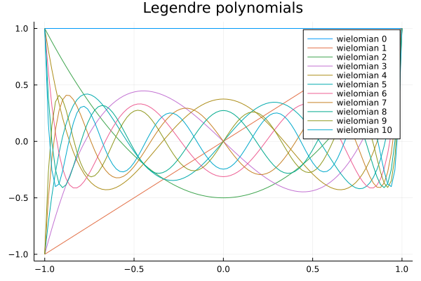

## Współczynik podpierdzialności [7/7]

```julia
using QuadGK
using Polynomials
using Plots
using DataFrames
```

### Zadanie 1 (1p)
- Korzytając z pakietu <a href="https://github.com/JuliaMath/Polynomials.jl">Polynomials</a> zaimplementuj wielomiany Legendre'a zdefiniowane w taki sposób:

$P_{0}(x)=1$

$P_{1}(x)=x$

$P_{k+1}(x)=\frac{2k+1}{k+1} x P_{k}(x)-\frac{k}{k+1}P_{k-1}(x)$

- narysuj ich wykresy w przedziale (-1,1). 
- sprawdź(np. za pomocą fukcji <i>roots</i> z pakietu Polynomials), że ich zera  sa odciętymi punktów Gaussa. Test wykonaj dla wielomianow od 2 do 4 stopnia
- podaj związek tego faktu z podstawowym twierdzeniem kwadratur Gaussa (z wykładu)


```julia
function legendre(k)
    if k == 0
        return Polynomial([1])
    end
    if k == 1
        return Polynomial([0,1])
    end
    
    return ((2 * k - 1)/(k))*Polynomial([0,1])*legendre(k - 1)-((k - 1)/k)*legendre(k - 2)
end
```


    legendre (generic function with 1 method)


```julia
p = plot(legendre(0),-1,1,label = "wielomian 0", title = "Legendre polynomials")

for k in 1:10
    plot!(legendre(k),-1,1, label = "wielomian "*string(k))
end
p
```


    

    


```julia
function checkPoints(i)
    (g,a)=gauss(Float64,i)
    l=roots(legendre(i))
    g=sort(g)
    l=sort(l)
    for j in 1:length(g)
        println("legendre: ",l[j])
        println("gauss: ",g[j],"\n")
    end
end
```


    checkPoints (generic function with 1 method)


```julia
checkPoints(2)
```

    legendre: -0.5773502691896258
    gauss: -0.5773502691896258
    
    legendre: 0.5773502691896256
    gauss: 0.5773502691896258
    
    


```julia
checkPoints(3)
```

    legendre: -0.7745966692414834
    gauss: -0.7745966692414834
    
    legendre: 0.0
    gauss: 0.0
    
    legendre: 0.7745966692414835
    gauss: 0.7745966692414834
    
    


```julia
checkPoints(4)
```

    legendre: -0.8611363115940536
    gauss: -0.8611363115940526
    
    legendre: -0.33998104358485653
    gauss: -0.3399810435848563
    
    legendre: 0.3399810435848563
    gauss: 0.3399810435848563
    
    legendre: 0.8611363115940531
    gauss: 0.8611363115940526
    
    

Odcięte xi n-punktowej kwadratury Gaussa z funkcją ważącą w(x) w [a,b] są zerami wielomianu ortogonalnego φn(x) dla tego samego przedziału i tej samej funkcji ważącej.

Dlatego w najprostszej postaci dla funkcji ważącej w(x) = 1, wielomianem ortagonalnym dla kwadratury Gaussa jest wielomian Legendre'a. Wtedy ta kwadratura jest nazywana kwadraturą Gaussa-Legendre'a.

### Zadanie 2 (1p)
- Napisz funkcję, która dla podanej liczby punktów Gaussa $k$ oraz funkcji $f$  policzy $\int_{-1}^{1} f dx$
metodą używającą funkcji:
```julia
gauss(k)
```
oraz sumy 
```julia
sum(a .* f.(xp)) 
```
- przetestuj dla wielomianów coraz większych stopni
- sprawdz kiedy przestaje być dokładna, 
- podaj związek z twierdzeniem o  stopniu dokładności kwadratury Gaussa 


```julia
function integral(f, k)
    (xp,a) = gauss(Float64,k)
    return sum(a .* f.(xp)) 
end
```


    integral (generic function with 1 method)


```julia
f(x) = x^2
integral(f,2)==quadgk(f, -1, 1)[1]
```


    true


```julia
# Accurate to degree 2*k-1 
function test(k)
    for d in 1:2*k+2
        if d == 2*k
            println("\n")
        end
        println("Degree: ",d)
        f(x) = x^d - x^(d-1)
        int = 1/(d+1) - (-1)^(d+1)/(d+1) - 1/d + (-1)^d/d
        println("true: ", round(int,digits = 5))
        own = integral(f,k)
        println("gaus: ", round(own,digits = 5))
        
        err = round(abs((int - own)/int)*100,digits=3)
        println("Error: ",err,"% \n")
    end
end
```


    test (generic function with 1 method)


```julia
test(1)
```

    Degree: 1
    true: -2.0
    gaus: -2.0
    Error: 0.0% 
    
    
    
    Degree: 2
    true: 0.66667
    gaus: 0.0
    Error: 100.0% 
    
    Degree: 3
    true: -0.66667
    gaus: 0.0
    Error: 100.0% 
    
    Degree: 4
    true: 0.4
    gaus: 0.0
    Error: 100.0% 
    
    


```julia
test(2)
```

    Degree: 1
    true: -2.0
    gaus: -2.0
    Error: 0.0% 
    
    Degree: 2
    true: 0.66667
    gaus: 0.66667
    Error: 0.0% 
    
    Degree: 3
    true: -0.66667
    gaus: -0.66667
    Error: 0.0% 
    
    
    
    Degree: 4
    true: 0.4
    gaus: 0.22222
    Error: 44.444% 
    
    Degree: 5
    true: -0.4
    gaus: -0.22222
    Error: 44.444% 
    
    Degree: 6
    true: 0.28571
    gaus: 0.07407
    Error: 74.074% 
    
    


```julia
test(3)
```

    Degree: 1
    true: -2.0
    gaus: -2.0
    Error: 0.0% 
    
    Degree: 2
    true: 0.66667
    gaus: 0.66667
    Error: 0.0% 
    
    Degree: 3
    true: -0.66667
    gaus: -0.66667
    Error: 0.0% 
    
    Degree: 4
    true: 0.4
    gaus: 0.4
    Error: 0.0% 
    
    Degree: 5
    true: -0.4
    gaus: -0.4
    Error: 0.0% 
    
    
    
    Degree: 6
    true: 0.28571
    gaus: 0.24
    Error: 16.0% 
    
    Degree: 7
    true: -0.28571
    gaus: -0.24
    Error: 16.0% 
    
    Degree: 8
    true: 0.22222
    gaus: 0.144
    Error: 35.2% 
    
    


```julia
test(4)
```

    Degree: 1
    true: -2.0
    gaus: -2.0
    Error: 0.0% 
    
    Degree: 2
    true: 0.66667
    gaus: 0.66667
    Error: 0.0% 
    
    Degree: 3
    true: -0.66667
    gaus: -0.66667
    Error: 0.0% 
    
    Degree: 4
    true: 0.4
    gaus: 0.4
    Error: 0.0% 
    
    Degree: 5
    true: -0.4
    gaus: -0.4
    Error: 0.0% 
    
    Degree: 6
    true: 0.28571
    gaus: 0.28571
    Error: 0.0% 
    
    Degree: 7
    true: -0.28571
    gaus: -0.28571
    Error: 0.0% 
    
    
    
    Degree: 8
    true: 0.22222
    gaus: 0.21061
    Error: 5.224% 
    
    Degree: 9
    true: -0.22222
    gaus: -0.21061
    Error: 5.224% 
    
    Degree: 10
    true: 0.18182
    gaus: 0.15603
    Error: 14.181% 
    
    

### Stopień dokładności kwadratury:
Stopień dokładności kwadratury to liczba całkowita n>0  taka, że kwadratura jest dokładna dla wielomianów stopnia <=n oraz daje niezerowy błąd dla wielomianów stopnia > n .

### Twierdzenie o stopniu dokładności kwadratury Gaussa:
Kwadratura ma stopień dokładności 2n-1  (dla  n- punktowej kwadratury).

### Zadanie 3 (1p)
  
Skorzystaj z rozwiązania zadania 2 do napisania funkcji 
liczącej  całki w dowolnym przedziale $\int_{a}^{b} f(x) dx$ 

dokonując normalizacji  do $\int_{-1}^{1} F(z) dz$ 

podstawiając:

$x=\frac{b+a}{2}+ \frac{b-a}{2} z $ oraz 

$dx =\frac{b-a}{2} dz $

Przetestuj działanie na kilku przykładach i sprawdź z wynikami otrzymanymi analitycznie.


```julia
function integral2(f,k,a,b)
    g(z) = f((b + a)/2 + (b - a) * z/2)*(b - a)/2
    return integral(g,k)
end
```


    integral2 (generic function with 1 method)


```julia
f(x) = 4x^3 - 3x^2 - 2x^1
println("true value : 4 \n")
println(quadgk(f, 0, 2)[1])
integral2(f,3,0,2)
```

    true value : 4 
    
    3.9999999999999996
    


    4.000000000000001


```julia
f(x) = 5x^4 + 4x^3 + 3x^2
println("true value : 111000 \n")
println(quadgk(f, 0, 10)[1])
integral2(f,4,0,10)
```

    true value : 111000 
    
    110999.99999999999
    


    111000.00000000007


```julia
f(x) = sin(x)
println("true value : 2 \n")
println(quadgk(f, 0, pi)[1])
integral2(f,20,0,pi)
```

    true value : 2 
    
    2.0
    


    2.0


```julia
f(x) = tan(x)
println("true value : 0 \n")
println(quadgk(f, -pi/4, pi/4)[1])
integral2(f,10,-pi/4,pi/4)
```

    true value : 0 
    
    -3.0357660829594124e-17
    


    0.0


### Zadanie 4 (1p)
Głowną funkcją pakietu QuadGK jest adaptacyjna funkcja <a href="https://juliamath.github.io/QuadGK.jl/stable/#QuadGK.quadgk"> guadgk</a> używająca całkowania  Gauss-Kronroda

- użyj tej funkcji do policzenia  całki dla przykładowego wielomianu.
- funkcja ta ma możliwość liczenia również całek do nieskończoności.


 Policz całkę od minus do plus nieskonczonosci 
 standardowego rozkładu normalnego Gaussa
$ \frac{1}{\sqrt{2\pi}}exp(\frac{-x^2}{2})$


```julia
f(x) = 1/sqrt(2*pi)*exp((-x^2)/2)
println("true value : 1 \n")
quadgk(f, -Inf, +Inf)[1]
```

    true value : 1 
    
    


    1.0000000000032583


### Zadanie 5 (3p)
Napisz własne funkcje całkujące -  w wybranym przedziale (a,b) - złożonymi metodami prostokątów, trapezów oraz Simpsona. Dla stałego przedziału zwiększaj liczbę użytych punktów (n). Narysuj wykresy funkcji błędu  w stosunku do wyniku otrzymanego analitycznie, 
w zależnosci od $h=\frac{b-a}{n}$:
1. wykładniczej
2. trygonometrycznej (np. sin (x) w przedziale $[0,2\pi]$)


```julia
function rectangleIntegral(f, a, b, n)
    result = 0
    h = (b-a)/n
    for i in 1:n
       result += f(a + (i-1)*h + h/2) * h
    end
    return result
end
```


    rectangleIntegral (generic function with 1 method)


```julia
function trapezeIntegral(f, a, b, n)
    result = 0
    h = (b-a)/n
    for i in 1:n
       result += (f(a + (i-1) * h) + f(a + i * h)) * h
    end
    return result / 2
end
```


    trapezeIntegral (generic function with 1 method)


```julia
function simpsonIntegral(f, a, b, n)
    result = 0
    h = (b-a)/n
    x = a
    for i in 1:n
       result += f(x) + 4 * f((x + (x + h)) / 2) + f(x + h)
       x += h
    end
    return result * h / 6
end
```


    simpsonIntegral (generic function with 1 method)


```julia
function showPlot(f,a,b,text)
    data=DataFrame(n = Int64[], func = String[], error = Float64[])
    for i in 1:1:10000
        push!(data, (i,"rect",abs(rectangleIntegral(f, a, b, i) - quadgk(f, a, b)[1])/quadgk(f, a, b)[1]*100))
        push!(data, (i,"trap",abs(trapezeIntegral(f, a, b, i) - quadgk(f, a, b)[1])/quadgk(f, a, b)[1]*100))
        push!(data, (i,"simp",abs(simpsonIntegral(f, a, b, i) - quadgk(f, a, b)[1])/quadgk(f, a, b)[1]*100))
    end
    plot((b-a) ./ data.n, data.error, group=data.func, title=text, ylabel="error [%]", xlabel="h")
end
```


    showPlot (generic function with 1 method)


```julia
f(x)=Base.exp(x)
showPlot(f,0,10,"Integral of e^x from 0 to 10")
```


    

    


```julia
f(x)=sin(x)
showPlot(f,0,2*pi,"Integral of sin(x) from 0 to 2*Pi")
```


    

    


