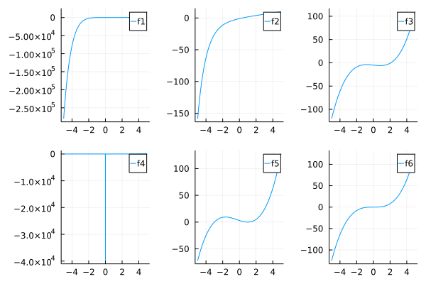
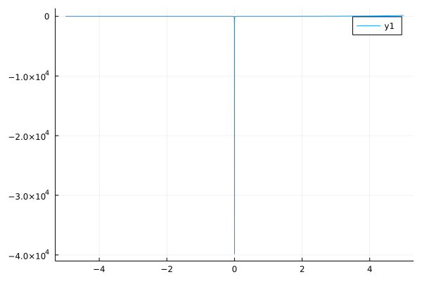

## Współczynik podpierdzialności [5/5]

Wybrać trzy metody poszukiwania pierwiastków: 

* wykorzystującą przedział i zmianę znaku, 
* wykorzystującą pochodną, 
* wykorzystującą przybliżenie pochodnej

### 1. Każdą z trzech wybranych metod przetestować (ilość iteracji, ilość wywołań funkcji) na sześciu wybranych  funkcjach ze zbioru http://people.sc.fsu.edu/~jburkardt/py_src/test_zero/test_zero.html Wyniki przedstawić w formie tabelki. <b>Pamiętać o sprawdzeniu czy wynik jest poprawny poprzez obliczenie wartości funkcji dla znalezionego pierwiastka !</b> (3 pkt)


```julia
using Roots
using Plots
using ForwardDiff
using DataFrames
```


```julia
f1(x)=(x-1)^7
f2(x)=2*x-exp(-x)
f3(x)=x^3 - 2*x - 5
f4(x)=exp(x)-1/(10*x)^2
f5(x)=(x+3)*(x-1)^2
f6(x)=x^3
D(f) = x->ForwardDiff.derivative(f, float(x))
plot(plot(f1),plot(f2),plot(f3),plot(f4),plot(f5),plot(f6),layout=(2,3),label=["f1" "f2" "f3" "f4" "f5" "f6"])
```


    

    


```julia
checkZero(f,x)=iszero(f(x))||f(prevfloat(x))*f(x)<0||f(nextfloat(x)*f(x))<0
```


    checkZero (generic function with 1 method)


```julia
data=DataFrame(Function=String[],Method=String[],Iter=Int[],Eval=Int[],root=Float64[],OK=Bool[])
```


<div class="data-frame"><p>0 rows × 6 columns</p><table class="data-frame"><thead><tr><th></th><th>Function</th><th>Method</th><th>Iter</th><th>Eval</th><th>root</th><th>OK</th></tr><tr><th></th><th title="String">String</th><th title="String">String</th><th title="Int64">Int64</th><th title="Int64">Int64</th><th title="Float64">Float64</th><th title="Bool">Bool</th></tr></thead><tbody></tbody></table></div>


```julia
x=find_zero(f1,(-5,5),Bisection(),verbose=true)
```


    Results of univariate zero finding:
    
    * Converged to: 1.0
    * Algorithm: Bisection()
    * iterations: 59
    * function evaluations ≈ 62
    * stopped as f(x_n) = 0
    
    Trace:
    (a₀, b₀) = ( 0, 5 )
    (a₁, b₁) = ( 2.4239607376400672e-154, 5 )
    (a₂, b₂) = ( 3.3465153150990973e-77, 5 )
    (a₃, b₃) = ( 1.285696946211877e-38, 5 )
    (a₄, b₄) = ( 2.541098841762901e-19, 5 )
    (a₅, b₅) = ( 1.127773430198431e-09, 5 )
    (a₆, b₆) = ( 7.5101852416992188e-05, 5 )
    (a₇, b₇) = ( 0.019378662109375, 5 )
    (a₈, b₈) = ( 0.311279296875, 5 )
    (a₉, b₉) = ( 0.311279296875, 1.24755859375 )
    (a₁₀, b₁₀) = ( 0.6231689453125, 1.24755859375 )
    (a₁₁, b₁₁) = ( 0.87347412109375, 1.24755859375 )
    (a₁₂, b₁₂) = ( 0.998626708984375, 1.24755859375 )
    (a₁₃, b₁₃) = ( 0.998626708984375, 1.122406005859375 )
    (a₁₄, b₁₄) = ( 0.998626708984375, 1.0598297119140625 )
    (a₁₅, b₁₅) = ( 0.998626708984375, 1.0285415649414062 )
    (a₁₆, b₁₆) = ( 0.998626708984375, 1.0128974914550781 )
    (a₁₇, b₁₇) = ( 0.998626708984375, 1.0050754547119141 )
    (a₁₈, b₁₈) = ( 0.998626708984375, 1.001164436340332 )
    (a₁₉, b₁₉) = ( 0.99960446357727051, 1.001164436340332 )
    (a₂₀, b₂₀) = ( 0.99960446357727051, 1.0001866817474365 )
    (a₂₁, b₂₁) = ( 0.99984890222549438, 1.0001866817474365 )
    (a₂₂, b₂₂) = ( 0.99997112154960632, 1.0001866817474365 )
    (a₂₃, b₂₃) = ( 0.99997112154960632, 1.0000644624233246 )
    (a₂₄, b₂₄) = ( 0.99997112154960632, 1.0000033527612686 )
    (a₂₅, b₂₅) = ( 0.99998639896512032, 1.0000033527612686 )
    (a₂₆, b₂₆) = ( 0.99999403767287731, 1.0000033527612686 )
    (a₂₇, b₂₇) = ( 0.99999785702675581, 1.0000033527612686 )
    (a₂₈, b₂₈) = ( 0.99999976670369506, 1.0000033527612686 )
    (a₂₉, b₂₉) = ( 0.99999976670369506, 1.0000014430843294 )
    (a₃₀, b₃₀) = ( 0.99999976670369506, 1.0000004882458597 )
    (a₃₁, b₃₁) = ( 0.99999976670369506, 1.0000000108266249 )
    (a₃₂, b₃₂) = ( 0.99999988605850376, 1.0000000108266249 )
    (a₃₃, b₃₃) = ( 0.99999994573590811, 1.0000000108266249 )
    (a₃₄, b₃₄) = ( 0.99999997557461029, 1.0000000108266249 )
    (a₃₅, b₃₅) = ( 0.99999999049396138, 1.0000000108266249 )
    (a₃₆, b₃₆) = ( 0.99999999795363692, 1.0000000108266249 )
    (a₃₇, b₃₇) = ( 0.99999999795363692, 1.0000000033669494 )
    (a₃₈, b₃₈) = ( 0.99999999981855581, 1.0000000033669494 )
    (a₃₉, b₃₉) = ( 0.99999999981855581, 1.0000000015020305 )
    (a₄₀, b₄₀) = ( 0.99999999981855581, 1.0000000005695711 )
    (a₄₁, b₄₁) = ( 0.99999999981855581, 1.0000000001033413 )
    (a₄₂, b₄₂) = ( 0.99999999993511324, 1.0000000001033413 )
    (a₄₃, b₄₃) = ( 0.99999999999339195, 1.0000000001033413 )
    (a₄₄, b₄₄) = ( 0.99999999999339195, 1.0000000000450626 )
    (a₄₅, b₄₅) = ( 0.99999999999339195, 1.0000000000159233 )
    (a₄₆, b₄₆) = ( 0.99999999999339195, 1.0000000000013536 )
    (a₄₇, b₄₇) = ( 0.99999999999703437, 1.0000000000013536 )
    (a₄₈, b₄₈) = ( 0.99999999999885558, 1.0000000000013536 )
    (a₄₉, b₄₉) = ( 0.99999999999976619, 1.0000000000013536 )
    (a₅₀, b₅₀) = ( 0.99999999999976619, 1.000000000000443 )
    (a₅₁, b₅₁) = ( 0.99999999999999378, 1.000000000000443 )
    (a₅₂, b₅₂) = ( 0.99999999999999378, 1.0000000000002152 )
    (a₅₃, b₅₃) = ( 0.99999999999999378, 1.0000000000001013 )
    (a₅₄, b₅₄) = ( 0.99999999999999378, 1.0000000000000444 )
    (a₅₅, b₅₅) = ( 0.99999999999999378, 1.000000000000016 )
    (a₅₆, b₅₆) = ( 0.99999999999999378, 1.0000000000000018 )
    (a₅₇, b₅₇) = ( 0.99999999999999734, 1.0000000000000018 )
    (a₅₈, b₅₈) = ( 0.99999999999999911, 1.0000000000000018 )
    (a₅₉, b₅₉) = ( 1, 1.0000000000000018 )
    
    


    1.0


```julia
push!(data,("f1","B",59,62,x,checkZero(f1,x)))
```


<div class="data-frame"><p>1 rows × 6 columns</p><table class="data-frame"><thead><tr><th></th><th>Function</th><th>Method</th><th>Iter</th><th>Eval</th><th>root</th><th>OK</th></tr><tr><th></th><th title="String">String</th><th title="String">String</th><th title="Int64">Int64</th><th title="Int64">Int64</th><th title="Float64">Float64</th><th title="Bool">Bool</th></tr></thead><tbody><tr><th>1</th><td>f1</td><td>B</td><td>59</td><td>62</td><td>1.0</td><td>1</td></tr></tbody></table></div>


```julia
x=find_zero(f2,(-5,5),Bisection(),verbose=true)
```


    Results of univariate zero finding:
    
    * Converged to: 0.35173371124919584
    * Algorithm: Bisection()
    * iterations: 61
    * function evaluations ≈ 64
    * stopped as f(x_n) = 0
    
    Trace:
    (a₀, b₀) = ( 0, 5 )
    (a₁, b₁) = ( 2.4239607376400672e-154, 5 )
    (a₂, b₂) = ( 3.3465153150990973e-77, 5 )
    (a₃, b₃) = ( 1.285696946211877e-38, 5 )
    (a₄, b₄) = ( 2.541098841762901e-19, 5 )
    (a₅, b₅) = ( 1.127773430198431e-09, 5 )
    (a₆, b₆) = ( 7.5101852416992188e-05, 5 )
    (a₇, b₇) = ( 0.019378662109375, 5 )
    (a₈, b₈) = ( 0.311279296875, 5 )
    (a₉, b₉) = ( 0.311279296875, 1.24755859375 )
    (a₁₀, b₁₀) = ( 0.311279296875, 0.6231689453125 )
    (a₁₁, b₁₁) = ( 0.311279296875, 0.436431884765625 )
    (a₁₂, b₁₂) = ( 0.311279296875, 0.3738555908203125 )
    (a₁₃, b₁₃) = ( 0.34256744384765625, 0.3738555908203125 )
    (a₁₄, b₁₄) = ( 0.34256744384765625, 0.35821151733398438 )
    (a₁₅, b₁₅) = ( 0.35038948059082031, 0.35821151733398438 )
    (a₁₆, b₁₆) = ( 0.35038948059082031, 0.35430049896240234 )
    (a₁₇, b₁₇) = ( 0.35038948059082031, 0.35234498977661133 )
    (a₁₈, b₁₈) = ( 0.35136723518371582, 0.35234498977661133 )
    (a₁₉, b₁₉) = ( 0.35136723518371582, 0.35185611248016357 )
    (a₂₀, b₂₀) = ( 0.3516116738319397, 0.35185611248016357 )
    (a₂₁, b₂₁) = ( 0.3516116738319397, 0.35173389315605164 )
    (a₂₂, b₂₂) = ( 0.35167278349399567, 0.35173389315605164 )
    (a₂₃, b₂₃) = ( 0.35170333832502365, 0.35173389315605164 )
    (a₂₄, b₂₄) = ( 0.35171861574053764, 0.35173389315605164 )
    (a₂₅, b₂₅) = ( 0.35172625444829464, 0.35173389315605164 )
    (a₂₆, b₂₆) = ( 0.35173007380217314, 0.35173389315605164 )
    (a₂₇, b₂₇) = ( 0.35173198347911239, 0.35173389315605164 )
    (a₂₈, b₂₈) = ( 0.35173293831758201, 0.35173389315605164 )
    (a₂₉, b₂₉) = ( 0.35173341573681682, 0.35173389315605164 )
    (a₃₀, b₃₀) = ( 0.35173365444643423, 0.35173389315605164 )
    (a₃₁, b₃₁) = ( 0.35173365444643423, 0.35173377380124293 )
    (a₃₂, b₃₂) = ( 0.35173365444643423, 0.35173371412383858 )
    (a₃₃, b₃₃) = ( 0.35173368428513641, 0.35173371412383858 )
    (a₃₄, b₃₄) = ( 0.35173369920448749, 0.35173371412383858 )
    (a₃₅, b₃₅) = ( 0.35173370666416304, 0.35173371412383858 )
    (a₃₆, b₃₆) = ( 0.35173371039400081, 0.35173371412383858 )
    (a₃₇, b₃₇) = ( 0.35173371039400081, 0.3517337122589197 )
    (a₃₈, b₃₈) = ( 0.35173371039400081, 0.35173371132646025 )
    (a₃₉, b₃₉) = ( 0.35173371086023053, 0.35173371132646025 )
    (a₄₀, b₄₀) = ( 0.35173371109334539, 0.35173371132646025 )
    (a₄₁, b₄₁) = ( 0.35173371120990282, 0.35173371132646025 )
    (a₄₂, b₄₂) = ( 0.35173371120990282, 0.35173371126818154 )
    (a₄₃, b₄₃) = ( 0.35173371123904218, 0.35173371126818154 )
    (a₄₄, b₄₄) = ( 0.35173371123904218, 0.35173371125361186 )
    (a₄₅, b₄₅) = ( 0.35173371124632702, 0.35173371125361186 )
    (a₄₆, b₄₆) = ( 0.35173371124632702, 0.35173371124996944 )
    (a₄₇, b₄₇) = ( 0.35173371124814823, 0.35173371124996944 )
    (a₄₈, b₄₈) = ( 0.35173371124905883, 0.35173371124996944 )
    (a₄₉, b₄₉) = ( 0.35173371124905883, 0.35173371124951414 )
    (a₅₀, b₅₀) = ( 0.35173371124905883, 0.35173371124928648 )
    (a₅₁, b₅₁) = ( 0.35173371124917263, 0.35173371124928648 )
    (a₅₂, b₅₂) = ( 0.35173371124917263, 0.35173371124922953 )
    (a₅₃, b₅₃) = ( 0.35173371124917263, 0.35173371124920105 )
    (a₅₄, b₅₄) = ( 0.35173371124918684, 0.35173371124920105 )
    (a₅₅, b₅₅) = ( 0.35173371124919395, 0.35173371124920105 )
    (a₅₆, b₅₆) = ( 0.35173371124919395, 0.3517337112491975 )
    (a₅₇, b₅₇) = ( 0.35173371124919572, 0.3517337112491975 )
    (a₅₈, b₅₈) = ( 0.35173371124919572, 0.35173371124919661 )
    (a₅₉, b₅₉) = ( 0.35173371124919572, 0.35173371124919617 )
    (a₆₀, b₆₀) = ( 0.35173371124919572, 0.35173371124919595 )
    (a₆₁, b₆₁) = ( 0.35173371124919584, 0.35173371124919595 )
    
    


    0.35173371124919584


```julia
push!(data,("f2","B",61,64,x,checkZero(f2,x)))
```


<div class="data-frame"><p>2 rows × 6 columns</p><table class="data-frame"><thead><tr><th></th><th>Function</th><th>Method</th><th>Iter</th><th>Eval</th><th>root</th><th>OK</th></tr><tr><th></th><th title="String">String</th><th title="String">String</th><th title="Int64">Int64</th><th title="Int64">Int64</th><th title="Float64">Float64</th><th title="Bool">Bool</th></tr></thead><tbody><tr><th>1</th><td>f1</td><td>B</td><td>59</td><td>62</td><td>1.0</td><td>1</td></tr><tr><th>2</th><td>f2</td><td>B</td><td>61</td><td>64</td><td>0.351734</td><td>1</td></tr></tbody></table></div>


```julia
x=find_zero(f3,(-5,5),Bisection(),verbose=true)
```


    Results of univariate zero finding:
    
    * Converged to: 2.0945514815423265
    * Algorithm: Bisection()
    * iterations: 62
    * function evaluations ≈ 65
    * stopped as x_n ≈ x_{n-1} using atol=xatol, rtol=xrtol
    
    Trace:
    (a₀, b₀) = ( 0, 5 )
    (a₁, b₁) = ( 2.4239607376400672e-154, 5 )
    (a₂, b₂) = ( 3.3465153150990973e-77, 5 )
    (a₃, b₃) = ( 1.285696946211877e-38, 5 )
    (a₄, b₄) = ( 2.541098841762901e-19, 5 )
    (a₅, b₅) = ( 1.127773430198431e-09, 5 )
    (a₆, b₆) = ( 7.5101852416992188e-05, 5 )
    (a₇, b₇) = ( 0.019378662109375, 5 )
    (a₈, b₈) = ( 0.311279296875, 5 )
    (a₉, b₉) = ( 1.24755859375, 5 )
    (a₁₀, b₁₀) = ( 1.24755859375, 2.49755859375 )
    (a₁₁, b₁₁) = ( 1.7481689453125, 2.49755859375 )
    (a₁₂, b₁₂) = ( 1.99847412109375, 2.49755859375 )
    (a₁₃, b₁₃) = ( 1.99847412109375, 2.24725341796875 )
    (a₁₄, b₁₄) = ( 1.99847412109375, 2.122100830078125 )
    (a₁₅, b₁₅) = ( 2.0595245361328125, 2.122100830078125 )
    (a₁₆, b₁₆) = ( 2.0908126831054688, 2.122100830078125 )
    (a₁₇, b₁₇) = ( 2.0908126831054688, 2.1064567565917969 )
    (a₁₈, b₁₈) = ( 2.0908126831054688, 2.0986347198486328 )
    (a₁₉, b₁₉) = ( 2.0908126831054688, 2.0947237014770508 )
    (a₂₀, b₂₀) = ( 2.0927681922912598, 2.0947237014770508 )
    (a₂₁, b₂₁) = ( 2.0937459468841553, 2.0947237014770508 )
    (a₂₂, b₂₂) = ( 2.094234824180603, 2.0947237014770508 )
    (a₂₃, b₂₃) = ( 2.0944792628288269, 2.0947237014770508 )
    (a₂₄, b₂₄) = ( 2.0944792628288269, 2.0946014821529388 )
    (a₂₅, b₂₅) = ( 2.0945403724908829, 2.0946014821529388 )
    (a₂₆, b₂₆) = ( 2.0945403724908829, 2.0945709273219109 )
    (a₂₇, b₂₇) = ( 2.0945403724908829, 2.0945556499063969 )
    (a₂₈, b₂₈) = ( 2.0945480111986399, 2.0945556499063969 )
    (a₂₉, b₂₉) = ( 2.0945480111986399, 2.0945518305525184 )
    (a₃₀, b₃₀) = ( 2.0945499208755791, 2.0945518305525184 )
    (a₃₁, b₃₁) = ( 2.0945508757140487, 2.0945518305525184 )
    (a₃₂, b₃₂) = ( 2.0945513531332836, 2.0945518305525184 )
    (a₃₃, b₃₃) = ( 2.0945513531332836, 2.094551591842901 )
    (a₃₄, b₃₄) = ( 2.0945514724880923, 2.094551591842901 )
    (a₃₅, b₃₅) = ( 2.0945514724880923, 2.0945515321654966 )
    (a₃₆, b₃₆) = ( 2.0945514724880923, 2.0945515023267944 )
    (a₃₇, b₃₇) = ( 2.0945514724880923, 2.0945514874074433 )
    (a₃₈, b₃₈) = ( 2.0945514799477678, 2.0945514874074433 )
    (a₃₉, b₃₉) = ( 2.0945514799477678, 2.0945514836776056 )
    (a₄₀, b₄₀) = ( 2.0945514799477678, 2.0945514818126867 )
    (a₄₁, b₄₁) = ( 2.0945514808802272, 2.0945514818126867 )
    (a₄₂, b₄₂) = ( 2.094551481346457, 2.0945514818126867 )
    (a₄₃, b₄₃) = ( 2.094551481346457, 2.0945514815795718 )
    (a₄₄, b₄₄) = ( 2.0945514814630144, 2.0945514815795718 )
    (a₄₅, b₄₅) = ( 2.0945514815212931, 2.0945514815795718 )
    (a₄₆, b₄₆) = ( 2.0945514815212931, 2.0945514815504325 )
    (a₄₇, b₄₇) = ( 2.0945514815358628, 2.0945514815504325 )
    (a₄₈, b₄₈) = ( 2.0945514815358628, 2.0945514815431476 )
    (a₄₉, b₄₉) = ( 2.0945514815395052, 2.0945514815431476 )
    (a₅₀, b₅₀) = ( 2.0945514815413264, 2.0945514815431476 )
    (a₅₁, b₅₁) = ( 2.0945514815422368, 2.0945514815431476 )
    (a₅₂, b₅₂) = ( 2.0945514815422368, 2.094551481542692 )
    (a₅₃, b₅₃) = ( 2.0945514815422368, 2.0945514815424642 )
    (a₅₄, b₅₄) = ( 2.0945514815422368, 2.0945514815423505 )
    (a₅₅, b₅₅) = ( 2.0945514815422936, 2.0945514815423505 )
    (a₅₆, b₅₆) = ( 2.0945514815423221, 2.0945514815423505 )
    (a₅₇, b₅₇) = ( 2.0945514815423221, 2.0945514815423363 )
    (a₅₈, b₅₈) = ( 2.0945514815423221, 2.0945514815423292 )
    (a₅₉, b₅₉) = ( 2.0945514815423256, 2.0945514815423292 )
    (a₆₀, b₆₀) = ( 2.0945514815423256, 2.0945514815423274 )
    (a₆₁, b₆₁) = ( 2.0945514815423265, 2.0945514815423274 )
    (a₆₂, b₆₂) = ( 2.0945514815423265, 2.094551481542327 )
    
    


    2.0945514815423265


```julia
push!(data,("f3","B",62,65,x,checkZero(f3,x)))
```


<div class="data-frame"><p>3 rows × 6 columns</p><table class="data-frame"><thead><tr><th></th><th>Function</th><th>Method</th><th>Iter</th><th>Eval</th><th>root</th><th>OK</th></tr><tr><th></th><th title="String">String</th><th title="String">String</th><th title="Int64">Int64</th><th title="Int64">Int64</th><th title="Float64">Float64</th><th title="Bool">Bool</th></tr></thead><tbody><tr><th>1</th><td>f1</td><td>B</td><td>59</td><td>62</td><td>1.0</td><td>1</td></tr><tr><th>2</th><td>f2</td><td>B</td><td>61</td><td>64</td><td>0.351734</td><td>1</td></tr><tr><th>3</th><td>f3</td><td>B</td><td>62</td><td>65</td><td>2.09455</td><td>1</td></tr></tbody></table></div>


```julia
x=find_zero(f4,(-5,-5),Bisection(),verbose=true)
```


    ArgumentError: Need extrema to return two distinct values

    

    Stacktrace:

     [1] _extrema

       @ C:\Users\lawos\.julia\packages\Roots\kyxnO\src\utils.jl:44 [inlined]

     [2] adjust_bracket(x0::Tuple{Int64, Int64})

       @ Roots C:\Users\lawos\.julia\packages\Roots\kyxnO\src\Bracketing\bracketing.jl:59

     [3] init_state(M::Bisection, F::Roots.Callable_Function{Val{1}, Val{false}, typeof(f4), Nothing}, x::Tuple{Int64, Int64})

       @ Roots C:\Users\lawos\.julia\packages\Roots\kyxnO\src\Bracketing\bracketing.jl:4

     [4] #init#32

       @ C:\Users\lawos\.julia\packages\Roots\kyxnO\src\find_zero.jl:260 [inlined]

     [5] solve(𝑭𝑿::ZeroProblem{typeof(f4), Tuple{Int64, Int64}}, args::Bisection; verbose::Bool, kwargs::Base.Iterators.Pairs{Symbol, Union{Nothing, Roots.NullTracks}, Tuple{Symbol, Symbol}, NamedTuple{(:p, :tracks), Tuple{Nothing, Roots.NullTracks}}})

       @ Roots C:\Users\lawos\.julia\packages\Roots\kyxnO\src\find_zero.jl:439

     [6] find_zero(f::Function, x0::Tuple{Int64, Int64}, M::Bisection; p::Nothing, verbose::Bool, tracks::Roots.NullTracks, kwargs::Base.Iterators.Pairs{Union{}, Union{}, Tuple{}, NamedTuple{(), Tuple{}}})

       @ Roots C:\Users\lawos\.julia\packages\Roots\kyxnO\src\find_zero.jl:197

     [7] top-level scope

       @ In[11]:1

     [8] eval

       @ .\boot.jl:360 [inlined]

     [9] include_string(mapexpr::typeof(REPL.softscope), mod::Module, code::String, filename::String)

       @ Base .\loading.jl:1116


```julia
push!(data,("f4","B",-1,-1,0,0))
```


<div class="data-frame"><p>4 rows × 6 columns</p><table class="data-frame"><thead><tr><th></th><th>Function</th><th>Method</th><th>Iter</th><th>Eval</th><th>root</th><th>OK</th></tr><tr><th></th><th title="String">String</th><th title="String">String</th><th title="Int64">Int64</th><th title="Int64">Int64</th><th title="Float64">Float64</th><th title="Bool">Bool</th></tr></thead><tbody><tr><th>1</th><td>f1</td><td>B</td><td>59</td><td>62</td><td>1.0</td><td>1</td></tr><tr><th>2</th><td>f2</td><td>B</td><td>61</td><td>64</td><td>0.351734</td><td>1</td></tr><tr><th>3</th><td>f3</td><td>B</td><td>62</td><td>65</td><td>2.09455</td><td>1</td></tr><tr><th>4</th><td>f4</td><td>B</td><td>-1</td><td>-1</td><td>0.0</td><td>0</td></tr></tbody></table></div>


```julia
x=find_zero(f5,(-5,5),Bisection(),verbose=true)
```


    Results of univariate zero finding:
    
    * Converged to: -3.0
    * Algorithm: Bisection()
    * iterations: 61
    * function evaluations ≈ 64
    * stopped as f(x_n) = 0
    
    Trace:
    (a₀, b₀) = ( -5, 0 )
    (a₁, b₁) = ( -5, -2.4239607376400672e-154 )
    (a₂, b₂) = ( -5, -3.3465153150990973e-77 )
    (a₃, b₃) = ( -5, -1.285696946211877e-38 )
    (a₄, b₄) = ( -5, -2.541098841762901e-19 )
    (a₅, b₅) = ( -5, -1.127773430198431e-09 )
    (a₆, b₆) = ( -5, -7.5101852416992188e-05 )
    (a₇, b₇) = ( -5, -0.019378662109375 )
    (a₈, b₈) = ( -5, -0.311279296875 )
    (a₉, b₉) = ( -5, -1.24755859375 )
    (a₁₀, b₁₀) = ( -5, -2.49755859375 )
    (a₁₁, b₁₁) = ( -3.498779296875, -2.49755859375 )
    (a₁₂, b₁₂) = ( -3.498779296875, -2.9981689453125 )
    (a₁₃, b₁₃) = ( -3.24847412109375, -2.9981689453125 )
    (a₁₄, b₁₄) = ( -3.123321533203125, -2.9981689453125 )
    (a₁₅, b₁₅) = ( -3.0607452392578125, -2.9981689453125 )
    (a₁₆, b₁₆) = ( -3.0294570922851562, -2.9981689453125 )
    (a₁₇, b₁₇) = ( -3.0138130187988281, -2.9981689453125 )
    (a₁₈, b₁₈) = ( -3.0059909820556641, -2.9981689453125 )
    (a₁₉, b₁₉) = ( -3.002079963684082, -2.9981689453125 )
    (a₂₀, b₂₀) = ( -3.000124454498291, -2.9981689453125 )
    (a₂₁, b₂₁) = ( -3.000124454498291, -2.9991466999053955 )
    (a₂₂, b₂₂) = ( -3.000124454498291, -2.9996355772018433 )
    (a₂₃, b₂₃) = ( -3.000124454498291, -2.9998800158500671 )
    (a₂₄, b₂₄) = ( -3.0000022351741791, -2.9998800158500671 )
    (a₂₅, b₂₅) = ( -3.0000022351741791, -2.9999411255121231 )
    (a₂₆, b₂₆) = ( -3.0000022351741791, -2.9999716803431511 )
    (a₂₇, b₂₇) = ( -3.0000022351741791, -2.9999869577586651 )
    (a₂₈, b₂₈) = ( -3.0000022351741791, -2.9999945964664221 )
    (a₂₉, b₂₉) = ( -3.0000022351741791, -2.9999984158203006 )
    (a₃₀, b₃₀) = ( -3.0000003254972398, -2.9999984158203006 )
    (a₃₁, b₃₁) = ( -3.0000003254972398, -2.9999993706587702 )
    (a₃₂, b₃₂) = ( -3.0000003254972398, -2.999999848078005 )
    (a₃₃, b₃₃) = ( -3.0000000867876224, -2.999999848078005 )
    (a₃₄, b₃₄) = ( -3.0000000867876224, -2.9999999674328137 )
    (a₃₅, b₃₅) = ( -3.0000000271102181, -2.9999999674328137 )
    (a₃₆, b₃₆) = ( -3.0000000271102181, -2.9999999972715159 )
    (a₃₇, b₃₇) = ( -3.000000012190867, -2.9999999972715159 )
    (a₃₈, b₃₈) = ( -3.0000000047311914, -2.9999999972715159 )
    (a₃₉, b₃₉) = ( -3.0000000010013537, -2.9999999972715159 )
    (a₄₀, b₄₀) = ( -3.0000000010013537, -2.9999999991364348 )
    (a₄₁, b₄₁) = ( -3.0000000000688942, -2.9999999991364348 )
    (a₄₂, b₄₂) = ( -3.0000000000688942, -2.9999999996026645 )
    (a₄₃, b₄₃) = ( -3.0000000000688942, -2.9999999998357794 )
    (a₄₄, b₄₄) = ( -3.0000000000688942, -2.9999999999523368 )
    (a₄₅, b₄₅) = ( -3.0000000000106155, -2.9999999999523368 )
    (a₄₆, b₄₆) = ( -3.0000000000106155, -2.9999999999814762 )
    (a₄₇, b₄₇) = ( -3.0000000000106155, -2.9999999999960458 )
    (a₄₈, b₄₈) = ( -3.0000000000033307, -2.9999999999960458 )
    (a₄₉, b₄₉) = ( -3.0000000000033307, -2.9999999999996882 )
    (a₅₀, b₅₀) = ( -3.0000000000015095, -2.9999999999996882 )
    (a₅₁, b₅₁) = ( -3.0000000000005986, -2.9999999999996882 )
    (a₅₂, b₅₂) = ( -3.0000000000001434, -2.9999999999996882 )
    (a₅₃, b₅₃) = ( -3.0000000000001434, -2.9999999999999156 )
    (a₅₄, b₅₄) = ( -3.0000000000000293, -2.9999999999999156 )
    (a₅₅, b₅₅) = ( -3.0000000000000293, -2.9999999999999725 )
    (a₅₆, b₅₆) = ( -3.0000000000000009, -2.9999999999999725 )
    (a₅₇, b₅₇) = ( -3.0000000000000009, -2.9999999999999867 )
    (a₅₈, b₅₈) = ( -3.0000000000000009, -2.9999999999999938 )
    (a₅₉, b₅₉) = ( -3.0000000000000009, -2.9999999999999973 )
    (a₆₀, b₆₀) = ( -3.0000000000000009, -2.9999999999999991 )
    (a₆₁, b₆₁) = ( -3, -2.9999999999999991 )
    
    


    -3.0


```julia
push!(data,("f5","B",61,64,x,checkZero(f5,x)))
```


<div class="data-frame"><p>5 rows × 6 columns</p><table class="data-frame"><thead><tr><th></th><th>Function</th><th>Method</th><th>Iter</th><th>Eval</th><th>root</th><th>OK</th></tr><tr><th></th><th title="String">String</th><th title="String">String</th><th title="Int64">Int64</th><th title="Int64">Int64</th><th title="Float64">Float64</th><th title="Bool">Bool</th></tr></thead><tbody><tr><th>1</th><td>f1</td><td>B</td><td>59</td><td>62</td><td>1.0</td><td>1</td></tr><tr><th>2</th><td>f2</td><td>B</td><td>61</td><td>64</td><td>0.351734</td><td>1</td></tr><tr><th>3</th><td>f3</td><td>B</td><td>62</td><td>65</td><td>2.09455</td><td>1</td></tr><tr><th>4</th><td>f4</td><td>B</td><td>-1</td><td>-1</td><td>0.0</td><td>0</td></tr><tr><th>5</th><td>f5</td><td>B</td><td>61</td><td>64</td><td>-3.0</td><td>1</td></tr></tbody></table></div>


```julia
x=find_zero(f6,(-5,5),Bisection(),verbose=true)
```


    Results of univariate zero finding:
    
    * Converged to: 0.0
    * Algorithm: Bisection()
    * iterations: 0
    * function evaluations ≈ 3
    * stopped as f(x_n) = 0
    
    Trace:
    (a₀, b₀) = ( 0, 5 )
    
    


    0.0


```julia
push!(data,("f6","B",0,3,x,checkZero(f6,x)))
```


<div class="data-frame"><p>6 rows × 6 columns</p><table class="data-frame"><thead><tr><th></th><th>Function</th><th>Method</th><th>Iter</th><th>Eval</th><th>root</th><th>OK</th></tr><tr><th></th><th title="String">String</th><th title="String">String</th><th title="Int64">Int64</th><th title="Int64">Int64</th><th title="Float64">Float64</th><th title="Bool">Bool</th></tr></thead><tbody><tr><th>1</th><td>f1</td><td>B</td><td>59</td><td>62</td><td>1.0</td><td>1</td></tr><tr><th>2</th><td>f2</td><td>B</td><td>61</td><td>64</td><td>0.351734</td><td>1</td></tr><tr><th>3</th><td>f3</td><td>B</td><td>62</td><td>65</td><td>2.09455</td><td>1</td></tr><tr><th>4</th><td>f4</td><td>B</td><td>-1</td><td>-1</td><td>0.0</td><td>0</td></tr><tr><th>5</th><td>f5</td><td>B</td><td>61</td><td>64</td><td>-3.0</td><td>1</td></tr><tr><th>6</th><td>f6</td><td>B</td><td>0</td><td>3</td><td>0.0</td><td>1</td></tr></tbody></table></div>


```julia
x=find_zero((f1,D(f1)),0,Roots.Newton(),verbose=true)
```


    Results of univariate zero finding:
    
    * Converged to: 0.9938233080518548
    * Algorithm: Roots.Newton()
    * iterations: 33
    * function evaluations ≈ 66
    * stopped as |f(x_n)| ≤ max(δ, |x|⋅ϵ) using δ = atol, ϵ = rtol
    
    Trace:
    x₁ = 0,	 fx₁ = -1
    x₂ = 0.14285714285714285,	 fx₂ = -0.33991667708911394
    x₃ = 0.26530612244897961,	 fx₃ = -0.11554334736330474
    x₄ = 0.37026239067055394,	 fx₄ = -0.03927511069548776
    x₅ = 0.46022490628904622,	 fx₅ = -0.013350265119917321
    x₆ = 0.53733563396203965,	 fx₆ = -0.0045379777578209921
    x₇ = 0.60343054339603397,	 fx₇ = -0.0015425343201428191
    x₈ = 0.66008332291088623,	 fx₈ = -0.00052433314039886255
    x₉ = 0.7086428482093311,	 fx₉ = -0.00017822957877208092
    x₁₀ = 0.7502652984651409,	 fx₁₀ = -6.0583206175198271e-05
    x₁₁ = 0.78594168439869216,	 fx₁₁ = -2.0593242130478093e-05
    x₁₂ = 0.81652144377030755,	 fx₁₂ = -6.9999864354836591e-06
    x₁₃ = 0.84273266608883501,	 fx₁₃ = -2.3794121288184786e-06
    x₁₄ = 0.86519942807614425,	 fx₁₄ = -8.0880186425351355e-07
    x₁₅ = 0.88445665263669504,	 fx₁₅ = -2.7492524212053532e-07
    x₁₆ = 0.90096284511716718,	 fx₁₆ = -9.3451674749532405e-08
    x₁₇ = 0.91511101010042906,	 fx₁₇ = -3.1765782749273564e-08
    x₁₈ = 0.9272380086575106,	 fx₁₈ = -1.0797719317267779e-08
    x₁₉ = 0.93763257884929485,	 fx₁₉ = -3.670324870466578e-09
    x₂₀ = 0.94654221044225273,	 fx₂₀ = -1.247604633806531e-09
    x₂₁ = 0.9541790375219309,	 fx₂₁ = -4.2408162144449762e-10
    x₂₂ = 0.96072488930451216,	 fx₂₂ = -1.441524155759779e-10
    x₂₃ = 0.96633561940386759,	 fx₂₃ = -4.8999810096955247e-11
    x₂₄ = 0.97114481663188645,	 fx₂₄ = -1.6655852626154825e-11
    x₂₅ = 0.97526698568447412,	 fx₂₅ = -5.6616020787685109e-12
    x₂₆ = 0.97880027344383491,	 fx₂₆ = -1.9244729656158414e-12
    x₂₇ = 0.98182880580900134,	 fx₂₇ = -6.5416045561997299e-13
    x₂₈ = 0.98442469069342975,	 fx₂₈ = -2.2236004835743872e-13
    x₂₉ = 0.98664973488008267,	 fx₂₉ = -7.5583888755033955e-14
    x₃₀ = 0.98855691561149939,	 fx₃₀ = -2.5692224307085119e-14
    x₃₁ = 0.99019164195271381,	 fx₃₁ = -8.7332155134922347e-15
    x₃₂ = 0.99159283595946901,	 fx₃₂ = -2.9685655976493002e-15
    x₃₃ = 0.99279385939383058,	 fx₃₃ = -1.0090649536740092e-15
    x₃₄ = 0.99382330805185481,	 fx₃₄ = -3.4299800601993736e-16
    
    


    0.9938233080518548


```julia
push!(data,("f1","N",33,66,x,checkZero(f1,x)))
```


<div class="data-frame"><p>7 rows × 6 columns</p><table class="data-frame"><thead><tr><th></th><th>Function</th><th>Method</th><th>Iter</th><th>Eval</th><th>root</th><th>OK</th></tr><tr><th></th><th title="String">String</th><th title="String">String</th><th title="Int64">Int64</th><th title="Int64">Int64</th><th title="Float64">Float64</th><th title="Bool">Bool</th></tr></thead><tbody><tr><th>1</th><td>f1</td><td>B</td><td>59</td><td>62</td><td>1.0</td><td>1</td></tr><tr><th>2</th><td>f2</td><td>B</td><td>61</td><td>64</td><td>0.351734</td><td>1</td></tr><tr><th>3</th><td>f3</td><td>B</td><td>62</td><td>65</td><td>2.09455</td><td>1</td></tr><tr><th>4</th><td>f4</td><td>B</td><td>-1</td><td>-1</td><td>0.0</td><td>0</td></tr><tr><th>5</th><td>f5</td><td>B</td><td>61</td><td>64</td><td>-3.0</td><td>1</td></tr><tr><th>6</th><td>f6</td><td>B</td><td>0</td><td>3</td><td>0.0</td><td>1</td></tr><tr><th>7</th><td>f1</td><td>N</td><td>33</td><td>66</td><td>0.993823</td><td>1</td></tr></tbody></table></div>


```julia
x=find_zero((f2,D(f2)),0,Roots.Newton(),verbose=true)
```


    Results of univariate zero finding:
    
    * Converged to: 0.3517337112491958
    * Algorithm: Roots.Newton()
    * iterations: 4
    * function evaluations ≈ 8
    * stopped as |f(x_n)| ≤ max(δ, |x|⋅ϵ) using δ = atol, ϵ = rtol
    
    Trace:
    x₁ = 0,	 fx₁ = -1
    x₂ = 0.33333333333333331,	 fx₂ = -0.049864643907122641
    x₃ = 0.35168933155541537,	 fx₃ = -0.00011997974912580922
    x₄ = 0.35173371099294265,	 fx₄ = -6.9277206193874008e-10
    x₅ = 0.35173371124919578,	 fx₅ = -1.1102230246251565e-16
    
    


    0.3517337112491958


```julia
push!(data,("f2","N",4,8,x,checkZero(f2,x)))
```


<div class="data-frame"><p>8 rows × 6 columns</p><table class="data-frame"><thead><tr><th></th><th>Function</th><th>Method</th><th>Iter</th><th>Eval</th><th>root</th><th>OK</th></tr><tr><th></th><th title="String">String</th><th title="String">String</th><th title="Int64">Int64</th><th title="Int64">Int64</th><th title="Float64">Float64</th><th title="Bool">Bool</th></tr></thead><tbody><tr><th>1</th><td>f1</td><td>B</td><td>59</td><td>62</td><td>1.0</td><td>1</td></tr><tr><th>2</th><td>f2</td><td>B</td><td>61</td><td>64</td><td>0.351734</td><td>1</td></tr><tr><th>3</th><td>f3</td><td>B</td><td>62</td><td>65</td><td>2.09455</td><td>1</td></tr><tr><th>4</th><td>f4</td><td>B</td><td>-1</td><td>-1</td><td>0.0</td><td>0</td></tr><tr><th>5</th><td>f5</td><td>B</td><td>61</td><td>64</td><td>-3.0</td><td>1</td></tr><tr><th>6</th><td>f6</td><td>B</td><td>0</td><td>3</td><td>0.0</td><td>1</td></tr><tr><th>7</th><td>f1</td><td>N</td><td>33</td><td>66</td><td>0.993823</td><td>1</td></tr><tr><th>8</th><td>f2</td><td>N</td><td>4</td><td>8</td><td>0.351734</td><td>1</td></tr></tbody></table></div>


```julia
x=find_zero((f3,D(f3)),0,Roots.Newton(),verbose=true)
```


    Results of univariate zero finding:
    
    * Converged to: 2.0945514815423265
    * Algorithm: Roots.Newton()
    * iterations: 19
    * function evaluations ≈ 38
    * stopped as |f(x_n)| ≤ max(δ, |x|⋅ϵ) using δ = atol, ϵ = rtol
    
    Trace:
    x₁ = 0,	 fx₁ = -5
    x₂ = -2.5,	 fx₂ = -15.625
    x₃ = -1.5671641791044775,	 fx₃ = -5.714632451465107
    x₄ = -0.50259244508667966,	 fx₄ = -4.1217695422221725
    x₅ = -3.8207064676993294,	 fx₅ = -53.132487962368174
    x₆ = -2.5493933913606064,	 fx₆ = -16.470757614024016
    x₇ = -1.6081114997282251,	 fx₇ = -5.9423896750176617
    x₈ = -0.57610043366023933,	 fx₈ = -4.0390020905449111
    x₉ = -4.5977095833821693,	 fx₉ = -92.995257569234539
    x₁₀ = -3.083543146726655,	 fx₁₀ = -28.151976870282013
    x₁₁ = -2.0221942554643366,	 fx₁₁ = -9.2249089970538503
    x₁₂ = -1.1237641075795191,	 fx₁₂ = -4.1716125339957122
    x₁₃ = 1.2086516123957836,	 fx₁₃ = -5.6516581502357903
    x₁₄ = 3.5807900448965704,	 fx₁₄ = 33.751515208533078
    x₁₅ = 2.6552331980087693,	 fx₁₅ = 8.4096268679235848
    x₁₆ = 2.2161063074385283,	 fx₁₆ = 1.4513672740375592
    x₁₇ = 2.1021250154847473,	 fx₁₇ = 0.084892382341730688
    x₁₈ = 2.0945835767773091,	 fx₁₈ = 0.00035823543942559155
    x₁₉ = 2.0945514821222386,	 fx₁₉ = 6.4726526360914249e-09
    x₂₀ = 2.0945514815423265,	 fx₂₀ = -8.8817841970012523e-16
    
    


    2.0945514815423265


```julia
push!(data,("f3","N",19,38,x,checkZero(f3,x)))
```


<div class="data-frame"><p>9 rows × 6 columns</p><table class="data-frame"><thead><tr><th></th><th>Function</th><th>Method</th><th>Iter</th><th>Eval</th><th>root</th><th>OK</th></tr><tr><th></th><th title="String">String</th><th title="String">String</th><th title="Int64">Int64</th><th title="Int64">Int64</th><th title="Float64">Float64</th><th title="Bool">Bool</th></tr></thead><tbody><tr><th>1</th><td>f1</td><td>B</td><td>59</td><td>62</td><td>1.0</td><td>1</td></tr><tr><th>2</th><td>f2</td><td>B</td><td>61</td><td>64</td><td>0.351734</td><td>1</td></tr><tr><th>3</th><td>f3</td><td>B</td><td>62</td><td>65</td><td>2.09455</td><td>1</td></tr><tr><th>4</th><td>f4</td><td>B</td><td>-1</td><td>-1</td><td>0.0</td><td>0</td></tr><tr><th>5</th><td>f5</td><td>B</td><td>61</td><td>64</td><td>-3.0</td><td>1</td></tr><tr><th>6</th><td>f6</td><td>B</td><td>0</td><td>3</td><td>0.0</td><td>1</td></tr><tr><th>7</th><td>f1</td><td>N</td><td>33</td><td>66</td><td>0.993823</td><td>1</td></tr><tr><th>8</th><td>f2</td><td>N</td><td>4</td><td>8</td><td>0.351734</td><td>1</td></tr><tr><th>9</th><td>f3</td><td>N</td><td>19</td><td>38</td><td>2.09455</td><td>1</td></tr></tbody></table></div>


```julia
x=find_zero((f4,D(f4)),0,Roots.Newton(),verbose=true)
```


    Results of univariate zero finding:
    
    * Convergence failed: 
    * Algorithm Roots.Newton()
    
    Trace:
    x₁ = 0,	 fx₁ = -Inf
    x₂ = NaN,	 fx₂ = NaN
    
    


    Roots.ConvergenceFailed("Algorithm failed to converge")

    

    Stacktrace:

     [1] #find_zero#29

       @ C:\Users\lawos\.julia\packages\Roots\kyxnO\src\find_zero.jl:199 [inlined]

     [2] top-level scope

       @ In[23]:1

     [3] eval

       @ .\boot.jl:360 [inlined]

     [4] include_string(mapexpr::typeof(REPL.softscope), mod::Module, code::String, filename::String)

       @ Base .\loading.jl:1116


```julia
push!(data,("f4","N",-1,-1,0,0))
```


<div class="data-frame"><p>10 rows × 6 columns</p><table class="data-frame"><thead><tr><th></th><th>Function</th><th>Method</th><th>Iter</th><th>Eval</th><th>root</th><th>OK</th></tr><tr><th></th><th title="String">String</th><th title="String">String</th><th title="Int64">Int64</th><th title="Int64">Int64</th><th title="Float64">Float64</th><th title="Bool">Bool</th></tr></thead><tbody><tr><th>1</th><td>f1</td><td>B</td><td>59</td><td>62</td><td>1.0</td><td>1</td></tr><tr><th>2</th><td>f2</td><td>B</td><td>61</td><td>64</td><td>0.351734</td><td>1</td></tr><tr><th>3</th><td>f3</td><td>B</td><td>62</td><td>65</td><td>2.09455</td><td>1</td></tr><tr><th>4</th><td>f4</td><td>B</td><td>-1</td><td>-1</td><td>0.0</td><td>0</td></tr><tr><th>5</th><td>f5</td><td>B</td><td>61</td><td>64</td><td>-3.0</td><td>1</td></tr><tr><th>6</th><td>f6</td><td>B</td><td>0</td><td>3</td><td>0.0</td><td>1</td></tr><tr><th>7</th><td>f1</td><td>N</td><td>33</td><td>66</td><td>0.993823</td><td>1</td></tr><tr><th>8</th><td>f2</td><td>N</td><td>4</td><td>8</td><td>0.351734</td><td>1</td></tr><tr><th>9</th><td>f3</td><td>N</td><td>19</td><td>38</td><td>2.09455</td><td>1</td></tr><tr><th>10</th><td>f4</td><td>N</td><td>-1</td><td>-1</td><td>0.0</td><td>0</td></tr></tbody></table></div>


```julia
x=find_zero((f5,D(f5)),0,Roots.Newton(),verbose=true)
```


    Results of univariate zero finding:
    
    * Converged to: 0.9999999893171166
    * Algorithm: Roots.Newton()
    * iterations: 26
    * function evaluations ≈ 52
    * stopped as |f(x_n)| ≤ max(δ, |x|⋅ϵ) using δ = atol, ϵ = rtol
    
    Trace:
    x₁ = 0,	 fx₁ = 3
    x₂ = 0.59999999999999998,	 fx₂ = 0.57600000000000018
    x₃ = 0.81176470588235294,	 fx₃ = 0.13506045186240584
    x₄ = 0.90826507818317204,	 fx₄ = 0.032889207013273039
    x₅ = 0.95467723287473649,	 fx₅ = 0.008123512971538743
    x₆ = 0.97746922076976495,	 fx₆ = 0.0020191066159544178
    x₇ = 0.98876660798474947,	 fx₇ = 0.00050333885308786899
    x₈ = 0.99439122417482817,	 fx₈ = 0.00012565702210396592
    x₉ = 0.99719758237940248,	 fx₉ = 3.1392169169394192e-05
    x₁₀ = 0.99859928255261032,	 fx₁₀ = 7.8452892489345154e-06
    x₁₁ = 0.99929976396633591,	 fx₁₁ = 1.9609786642799847e-06
    x₁₂ = 0.99964991263687364,	 fx₁₂ = 4.9020174016911134e-07
    x₁₃ = 0.99982496397951515,	 fx₁₃ = 1.225450711836327e-07
    x₁₄ = 0.99991248390473375,	 fx₁₄ = 3.0635597430973551e-08
    x₁₅ = 0.99995624243107428,	 fx₁₅ = 7.6588155694515749e-09
    x₁₆ = 0.99997812133520936,	 fx₁₆ = 1.914693419293982e-09
    x₁₇ = 0.99998906069752214,	 fx₁₇ = 4.7867204572062349e-10
    x₁₈ = 0.99999453035624042,	 fx₁₈ = 1.1966784779156153e-10
    x₁₉ = 0.99999726517998999,	 fx₁₉ = 2.9916941494196689e-11
    x₂₀ = 0.9999986325904624,	 fx₂₀ = 7.4792328172876542e-12
    x₂₁ = 0.99999931629534811,	 fx₂₁ = 1.8698078844852709e-12
    x₂₂ = 0.99999965814770331,	 fx₂₂ = 4.6745193106581024e-13
    x₂₃ = 0.99999982907385898,	 fx₂₃ = 1.1686297774053625e-13
    x₂₄ = 0.99999991453693127,	 fx₂₄ = 2.9215743844847674e-14
    x₂₅ = 0.99999995726846613,	 fx₂₅ = 7.3039358684495011e-15
    x₂₆ = 0.99999997863423318,	 fx₂₆ = 1.8259839578891492e-15
    x₂₇ = 0.99999998931711664,	 fx₂₇ = 4.5649598594730742e-16
    
    


    0.9999999893171166


```julia
push!(data,("f5","N",26,52,x,checkZero(f5,x)))
```


<div class="data-frame"><p>11 rows × 6 columns</p><table class="data-frame"><thead><tr><th></th><th>Function</th><th>Method</th><th>Iter</th><th>Eval</th><th>root</th><th>OK</th></tr><tr><th></th><th title="String">String</th><th title="String">String</th><th title="Int64">Int64</th><th title="Int64">Int64</th><th title="Float64">Float64</th><th title="Bool">Bool</th></tr></thead><tbody><tr><th>1</th><td>f1</td><td>B</td><td>59</td><td>62</td><td>1.0</td><td>1</td></tr><tr><th>2</th><td>f2</td><td>B</td><td>61</td><td>64</td><td>0.351734</td><td>1</td></tr><tr><th>3</th><td>f3</td><td>B</td><td>62</td><td>65</td><td>2.09455</td><td>1</td></tr><tr><th>4</th><td>f4</td><td>B</td><td>-1</td><td>-1</td><td>0.0</td><td>0</td></tr><tr><th>5</th><td>f5</td><td>B</td><td>61</td><td>64</td><td>-3.0</td><td>1</td></tr><tr><th>6</th><td>f6</td><td>B</td><td>0</td><td>3</td><td>0.0</td><td>1</td></tr><tr><th>7</th><td>f1</td><td>N</td><td>33</td><td>66</td><td>0.993823</td><td>1</td></tr><tr><th>8</th><td>f2</td><td>N</td><td>4</td><td>8</td><td>0.351734</td><td>1</td></tr><tr><th>9</th><td>f3</td><td>N</td><td>19</td><td>38</td><td>2.09455</td><td>1</td></tr><tr><th>10</th><td>f4</td><td>N</td><td>-1</td><td>-1</td><td>0.0</td><td>0</td></tr><tr><th>11</th><td>f5</td><td>N</td><td>26</td><td>52</td><td>1.0</td><td>0</td></tr></tbody></table></div>


```julia
x=find_zero((f6,D(f6)),0,Roots.Newton(),verbose=true)
```


    Results of univariate zero finding:
    
    * Convergence failed: 
    * Algorithm Roots.Newton()
    
    Trace:
    x₁ = 0,	 fx₁ = 0
    x₂ = NaN,	 fx₂ = NaN
    
    


    Roots.ConvergenceFailed("Algorithm failed to converge")

    

    Stacktrace:

     [1] #find_zero#29

       @ C:\Users\lawos\.julia\packages\Roots\kyxnO\src\find_zero.jl:199 [inlined]

     [2] top-level scope

       @ In[27]:1

     [3] eval

       @ .\boot.jl:360 [inlined]

     [4] include_string(mapexpr::typeof(REPL.softscope), mod::Module, code::String, filename::String)

       @ Base .\loading.jl:1116


```julia
push!(data,("f6","N",-1,-1,0,0))
```


<div class="data-frame"><p>12 rows × 6 columns</p><table class="data-frame"><thead><tr><th></th><th>Function</th><th>Method</th><th>Iter</th><th>Eval</th><th>root</th><th>OK</th></tr><tr><th></th><th title="String">String</th><th title="String">String</th><th title="Int64">Int64</th><th title="Int64">Int64</th><th title="Float64">Float64</th><th title="Bool">Bool</th></tr></thead><tbody><tr><th>1</th><td>f1</td><td>B</td><td>59</td><td>62</td><td>1.0</td><td>1</td></tr><tr><th>2</th><td>f2</td><td>B</td><td>61</td><td>64</td><td>0.351734</td><td>1</td></tr><tr><th>3</th><td>f3</td><td>B</td><td>62</td><td>65</td><td>2.09455</td><td>1</td></tr><tr><th>4</th><td>f4</td><td>B</td><td>-1</td><td>-1</td><td>0.0</td><td>0</td></tr><tr><th>5</th><td>f5</td><td>B</td><td>61</td><td>64</td><td>-3.0</td><td>1</td></tr><tr><th>6</th><td>f6</td><td>B</td><td>0</td><td>3</td><td>0.0</td><td>1</td></tr><tr><th>7</th><td>f1</td><td>N</td><td>33</td><td>66</td><td>0.993823</td><td>1</td></tr><tr><th>8</th><td>f2</td><td>N</td><td>4</td><td>8</td><td>0.351734</td><td>1</td></tr><tr><th>9</th><td>f3</td><td>N</td><td>19</td><td>38</td><td>2.09455</td><td>1</td></tr><tr><th>10</th><td>f4</td><td>N</td><td>-1</td><td>-1</td><td>0.0</td><td>0</td></tr><tr><th>11</th><td>f5</td><td>N</td><td>26</td><td>52</td><td>1.0</td><td>0</td></tr><tr><th>12</th><td>f6</td><td>N</td><td>-1</td><td>-1</td><td>0.0</td><td>0</td></tr></tbody></table></div>


```julia
x=find_zero(f1,0,Order1(),verbose=true)
```


    Results of univariate zero finding:
    
    * Converged to: 0.9865580170713792
    * Algorithm: Secant()
    * iterations: 40
    * function evaluations ≈ 42
    
    Trace:
    x₁ = 6.0554544523933395e-06,	 fx₁ = -0.9999576125888644
    x₂ = 0,	 fx₂ = -1
    x₃ = 0.14285973807225885,	 fx₃ = -0.33990947287321355
    x₄ = 0.21642446331428594,	 fx₄ = -0.1813702625538253
    x₅ = 0.30058316137369456,	 fx₅ = -0.081875240159861973
    x₆ = 0.36983801904759422,	 fx₆ = -0.039460754412856125
    x₇ = 0.43426999039973957,	 fx₇ = -0.018546609072015573
    x₈ = 0.49140809310164607,	 fx₈ = -0.0088020962960889248
    x₉ = 0.54302022535729633,	 fx₉ = -0.0041617774635777137
    x₁₀ = 0.5893097620511607,	 fx₁₀ = -0.0019706098941453969
    x₁₁ = 0.63093990493793606,	 fx₁₁ = -0.00093256610145046361
    x₁₂ = 0.6683399263319808,	 fx₁₂ = -0.00044142034927470685
    x₁₃ = 0.70195343196346782,	 fx₁₃ = -0.00020892426235644384
    x₁₄ = 0.73215900214040375,	 fx₁₄ = -9.8887040655527031e-05
    x₁₅ = 0.75930381186877538,	 fx₁₅ = -4.6804163449333489e-05
    x₁₆ = 0.78369743563687011,	 fx₁₆ = -2.2152955625547021e-05
    x₁₇ = 0.8056189118072774,	 fx₁₇ = -1.0485232466340562e-05
    x₁₈ = 0.82531870846132294,	 fx₁₈ = -4.9627769916186816e-06
    x₁₉ = 0.84302201055615555,	 fx₁₉ = -2.3489368260848753e-06
    x₂₀ = 0.85893114638710089,	 fx₂₀ = -1.1117777023314805e-06
    x₂₁ = 0.87322795117203933,	 fx₂₁ = -5.2621662482354959e-07
    x₂₂ = 0.8860758275911983,	 fx₂₂ = -2.490641250121354e-07
    x₂₃ = 0.89762161953166153,	 fx₂₃ = -1.178847931846179e-07
    x₂₄ = 0.90799728829054616,	 fx₂₄ = -5.5796170951583217e-08
    x₂₅ = 0.9173214215533988,	 fx₂₅ = -2.6408942204588513e-08
    x₂₆ = 0.92570058852305526,	 fx₂₆ = -1.2499643196244249e-08
    x₂₇ = 0.93323055803047827,	 fx₂₇ = -5.9162187868690513e-09
    x₂₈ = 0.93999739308381725,	 fx₂₈ = -2.8002115089541522e-09
    x₂₉ = 0.94607843452741547,	 fx₂₉ = -1.3253709467478543e-09
    x₃₀ = 0.95154318499729529,	 fx₃₀ = -6.2731266580400359e-10
    x₃₁ = 0.95645410329566261,	 fx₃₁ = -2.9691399350690495e-10
    x₃₂ = 0.96086731825689953,	 fx₃₂ = -1.4053266312953033e-10
    x₃₃ = 0.96483327026644605,	 fx₃₃ = -6.6515657187474011e-11
    x₃₄ = 0.96839728776393141,	 fx₃₄ = -3.1482593103671633e-11
    x₃₅ = 0.97160010531992058,	 fx₃₅ = -1.4901058043187095e-11
    x₃₆ = 0.97447832920748256,	 fx₃₆ = -7.0528348816520733e-12
    x₃₇ = 0.97706485578981672,	 fx₃₇ = -3.3381844244671838e-12
    x₃₈ = 0.97938924750584422,	 fx₃₈ = -1.5799994525243626e-12
    x₃₉ = 0.98147807075105564,	 fx₃₉ = -7.4783114188659988e-13
    x₄₀ = 0.98335519951539008,	 fx₄₀ = -3.5395671554308929e-13
    x₄₁ = 0.98504208824854134,	 fx₄₁ = -1.6753161169777762e-13
    x₄₂ = 0.98655801707137925,	 fx₄₂ = -7.9294556892333009e-14
    
    


    0.9865580170713792


```julia
push!(data,("f1","S",40,42,x,checkZero(f1,x)))
```


<div class="data-frame"><p>13 rows × 6 columns</p><table class="data-frame"><thead><tr><th></th><th>Function</th><th>Method</th><th>Iter</th><th>Eval</th><th>root</th><th>OK</th></tr><tr><th></th><th title="String">String</th><th title="String">String</th><th title="Int64">Int64</th><th title="Int64">Int64</th><th title="Float64">Float64</th><th title="Bool">Bool</th></tr></thead><tbody><tr><th>1</th><td>f1</td><td>B</td><td>59</td><td>62</td><td>1.0</td><td>1</td></tr><tr><th>2</th><td>f2</td><td>B</td><td>61</td><td>64</td><td>0.351734</td><td>1</td></tr><tr><th>3</th><td>f3</td><td>B</td><td>62</td><td>65</td><td>2.09455</td><td>1</td></tr><tr><th>4</th><td>f4</td><td>B</td><td>-1</td><td>-1</td><td>0.0</td><td>0</td></tr><tr><th>5</th><td>f5</td><td>B</td><td>61</td><td>64</td><td>-3.0</td><td>1</td></tr><tr><th>6</th><td>f6</td><td>B</td><td>0</td><td>3</td><td>0.0</td><td>1</td></tr><tr><th>7</th><td>f1</td><td>N</td><td>33</td><td>66</td><td>0.993823</td><td>1</td></tr><tr><th>8</th><td>f2</td><td>N</td><td>4</td><td>8</td><td>0.351734</td><td>1</td></tr><tr><th>9</th><td>f3</td><td>N</td><td>19</td><td>38</td><td>2.09455</td><td>1</td></tr><tr><th>10</th><td>f4</td><td>N</td><td>-1</td><td>-1</td><td>0.0</td><td>0</td></tr><tr><th>11</th><td>f5</td><td>N</td><td>26</td><td>52</td><td>1.0</td><td>0</td></tr><tr><th>12</th><td>f6</td><td>N</td><td>-1</td><td>-1</td><td>0.0</td><td>0</td></tr><tr><th>13</th><td>f1</td><td>S</td><td>40</td><td>42</td><td>0.986558</td><td>1</td></tr></tbody></table></div>


```julia
x=find_zero(f2,0,Order1(),verbose=true)
```


    Results of univariate zero finding:
    
    * Converged to: 0.3517337112491957
    * Algorithm: Secant()
    * iterations: 5
    * function evaluations ≈ 7
    * stopped as |f(x_n)| ≤ max(δ, |x|⋅ϵ) using δ = atol, ϵ = rtol
    
    Trace:
    x₁ = 6.0554544523933395e-06,	 fx₁ = -0.99998183365497706
    x₂ = 0,	 fx₂ = -1
    x₃ = 0.33333366974734885,	 fx₃ = -0.049863730027956632
    x₄ = 0.35082722371724301,	 fx₄ = -0.0024509486253887491
    x₅ = 0.35173153265646406,	 fx₅ = -5.8897561466819681e-06
    x₆ = 0.35173371099220896,	 fx₆ = -6.9475558639453538e-10
    x₇ = 0.35173371124919572,	 fx₇ = -2.2204460492503131e-16
    
    


    0.3517337112491957


```julia
push!(data,("f2","S",5,7,x,checkZero(f2,x)))
```


<div class="data-frame"><p>14 rows × 6 columns</p><table class="data-frame"><thead><tr><th></th><th>Function</th><th>Method</th><th>Iter</th><th>Eval</th><th>root</th><th>OK</th></tr><tr><th></th><th title="String">String</th><th title="String">String</th><th title="Int64">Int64</th><th title="Int64">Int64</th><th title="Float64">Float64</th><th title="Bool">Bool</th></tr></thead><tbody><tr><th>1</th><td>f1</td><td>B</td><td>59</td><td>62</td><td>1.0</td><td>1</td></tr><tr><th>2</th><td>f2</td><td>B</td><td>61</td><td>64</td><td>0.351734</td><td>1</td></tr><tr><th>3</th><td>f3</td><td>B</td><td>62</td><td>65</td><td>2.09455</td><td>1</td></tr><tr><th>4</th><td>f4</td><td>B</td><td>-1</td><td>-1</td><td>0.0</td><td>0</td></tr><tr><th>5</th><td>f5</td><td>B</td><td>61</td><td>64</td><td>-3.0</td><td>1</td></tr><tr><th>6</th><td>f6</td><td>B</td><td>0</td><td>3</td><td>0.0</td><td>1</td></tr><tr><th>7</th><td>f1</td><td>N</td><td>33</td><td>66</td><td>0.993823</td><td>1</td></tr><tr><th>8</th><td>f2</td><td>N</td><td>4</td><td>8</td><td>0.351734</td><td>1</td></tr><tr><th>9</th><td>f3</td><td>N</td><td>19</td><td>38</td><td>2.09455</td><td>1</td></tr><tr><th>10</th><td>f4</td><td>N</td><td>-1</td><td>-1</td><td>0.0</td><td>0</td></tr><tr><th>11</th><td>f5</td><td>N</td><td>26</td><td>52</td><td>1.0</td><td>0</td></tr><tr><th>12</th><td>f6</td><td>N</td><td>-1</td><td>-1</td><td>0.0</td><td>0</td></tr><tr><th>13</th><td>f1</td><td>S</td><td>40</td><td>42</td><td>0.986558</td><td>1</td></tr><tr><th>14</th><td>f2</td><td>S</td><td>5</td><td>7</td><td>0.351734</td><td>1</td></tr></tbody></table></div>


```julia
x=find_zero(f3,0,Order1(),verbose=true)
```


    Results of univariate zero finding:
    
    * Converged to: 2.0945514815423265
    * Algorithm: Secant()
    * iterations: 12
    * function evaluations ≈ 14
    * stopped as |f(x_n)| ≤ max(δ, |x|⋅ϵ) using δ = atol, ϵ = rtol
    
    Trace:
    x₁ = 6.0554544523933395e-06,	 fx₁ = -5.0000121109089042
    x₂ = 0,	 fx₂ = -5
    x₃ = -2.5000000001244578,	 fx₃ = -15.625000002084668
    x₄ = 1.176470588063034,	 fx₄ = -5.724608182744042
    x₅ = 3.3022807576809083,	 fx₅ = 24.407002348308062
    x₆ = 1.5803464538888512,	 fx₆ = -4.2137856763281247
    x₇ = 1.8338636560934627,	 fx₇ = -2.5003413070038372
    x₈ = 2.2038082799496843,	 fx₈ = 1.2957754399762749
    x₉ = 2.0775305098770178,	 fx₉ = -0.18816298711778057
    x₁₀ = 2.0935424966209526,	 fx₁₀ = -0.011255326316085501
    x₁₁ = 2.0945612209371021,	 fx₁₁ = 0.00010870624432257614
    x₁₂ = 2.0945514760077542,	 fx₁₂ = -6.177378608640538e-08
    x₁₃ = 2.0945514815422963,	 fx₁₃ = -3.3839597790574771e-13
    x₁₄ = 2.0945514815423265,	 fx₁₄ = -8.8817841970012523e-16
    
    


    2.0945514815423265


```julia
push!(data,("f3","S",12,14,x,checkZero(f3,x)))
```


<div class="data-frame"><p>15 rows × 6 columns</p><table class="data-frame"><thead><tr><th></th><th>Function</th><th>Method</th><th>Iter</th><th>Eval</th><th>root</th><th>OK</th></tr><tr><th></th><th title="String">String</th><th title="String">String</th><th title="Int64">Int64</th><th title="Int64">Int64</th><th title="Float64">Float64</th><th title="Bool">Bool</th></tr></thead><tbody><tr><th>1</th><td>f1</td><td>B</td><td>59</td><td>62</td><td>1.0</td><td>1</td></tr><tr><th>2</th><td>f2</td><td>B</td><td>61</td><td>64</td><td>0.351734</td><td>1</td></tr><tr><th>3</th><td>f3</td><td>B</td><td>62</td><td>65</td><td>2.09455</td><td>1</td></tr><tr><th>4</th><td>f4</td><td>B</td><td>-1</td><td>-1</td><td>0.0</td><td>0</td></tr><tr><th>5</th><td>f5</td><td>B</td><td>61</td><td>64</td><td>-3.0</td><td>1</td></tr><tr><th>6</th><td>f6</td><td>B</td><td>0</td><td>3</td><td>0.0</td><td>1</td></tr><tr><th>7</th><td>f1</td><td>N</td><td>33</td><td>66</td><td>0.993823</td><td>1</td></tr><tr><th>8</th><td>f2</td><td>N</td><td>4</td><td>8</td><td>0.351734</td><td>1</td></tr><tr><th>9</th><td>f3</td><td>N</td><td>19</td><td>38</td><td>2.09455</td><td>1</td></tr><tr><th>10</th><td>f4</td><td>N</td><td>-1</td><td>-1</td><td>0.0</td><td>0</td></tr><tr><th>11</th><td>f5</td><td>N</td><td>26</td><td>52</td><td>1.0</td><td>0</td></tr><tr><th>12</th><td>f6</td><td>N</td><td>-1</td><td>-1</td><td>0.0</td><td>0</td></tr><tr><th>13</th><td>f1</td><td>S</td><td>40</td><td>42</td><td>0.986558</td><td>1</td></tr><tr><th>14</th><td>f2</td><td>S</td><td>5</td><td>7</td><td>0.351734</td><td>1</td></tr><tr><th>15</th><td>f3</td><td>S</td><td>12</td><td>14</td><td>2.09455</td><td>1</td></tr></tbody></table></div>


```julia
x=find_zero(f4,0,Order1(),verbose=true)
```


    Results of univariate zero finding:
    
    * Convergence failed: 
    * Algorithm Secant()
    
    Trace:
    x₁ = 6.0554544523933395e-06,	 fx₁ = -272713423.15357041
    x₂ = 0,	 fx₂ = -Inf
    
    


    Roots.ConvergenceFailed("Algorithm failed to converge")

    

    Stacktrace:

     [1] find_zero(f::Function, x0::Int64, M::Secant; p::Nothing, verbose::Bool, tracks::Roots.NullTracks, kwargs::Base.Iterators.Pairs{Union{}, Union{}, Tuple{}, NamedTuple{(), Tuple{}}})

       @ Roots C:\Users\lawos\.julia\packages\Roots\kyxnO\src\find_zero.jl:199

     [2] top-level scope

       @ In[35]:1

     [3] eval

       @ .\boot.jl:360 [inlined]

     [4] include_string(mapexpr::typeof(REPL.softscope), mod::Module, code::String, filename::String)

       @ Base .\loading.jl:1116


```julia
push!(data,("f4","S",-1,-1,0,0))
```


<div class="data-frame"><p>16 rows × 6 columns</p><table class="data-frame"><thead><tr><th></th><th>Function</th><th>Method</th><th>Iter</th><th>Eval</th><th>root</th><th>OK</th></tr><tr><th></th><th title="String">String</th><th title="String">String</th><th title="Int64">Int64</th><th title="Int64">Int64</th><th title="Float64">Float64</th><th title="Bool">Bool</th></tr></thead><tbody><tr><th>1</th><td>f1</td><td>B</td><td>59</td><td>62</td><td>1.0</td><td>1</td></tr><tr><th>2</th><td>f2</td><td>B</td><td>61</td><td>64</td><td>0.351734</td><td>1</td></tr><tr><th>3</th><td>f3</td><td>B</td><td>62</td><td>65</td><td>2.09455</td><td>1</td></tr><tr><th>4</th><td>f4</td><td>B</td><td>-1</td><td>-1</td><td>0.0</td><td>0</td></tr><tr><th>5</th><td>f5</td><td>B</td><td>61</td><td>64</td><td>-3.0</td><td>1</td></tr><tr><th>6</th><td>f6</td><td>B</td><td>0</td><td>3</td><td>0.0</td><td>1</td></tr><tr><th>7</th><td>f1</td><td>N</td><td>33</td><td>66</td><td>0.993823</td><td>1</td></tr><tr><th>8</th><td>f2</td><td>N</td><td>4</td><td>8</td><td>0.351734</td><td>1</td></tr><tr><th>9</th><td>f3</td><td>N</td><td>19</td><td>38</td><td>2.09455</td><td>1</td></tr><tr><th>10</th><td>f4</td><td>N</td><td>-1</td><td>-1</td><td>0.0</td><td>0</td></tr><tr><th>11</th><td>f5</td><td>N</td><td>26</td><td>52</td><td>1.0</td><td>0</td></tr><tr><th>12</th><td>f6</td><td>N</td><td>-1</td><td>-1</td><td>0.0</td><td>0</td></tr><tr><th>13</th><td>f1</td><td>S</td><td>40</td><td>42</td><td>0.986558</td><td>1</td></tr><tr><th>14</th><td>f2</td><td>S</td><td>5</td><td>7</td><td>0.351734</td><td>1</td></tr><tr><th>15</th><td>f3</td><td>S</td><td>12</td><td>14</td><td>2.09455</td><td>1</td></tr><tr><th>16</th><td>f4</td><td>S</td><td>-1</td><td>-1</td><td>0.0</td><td>0</td></tr></tbody></table></div>


```julia
x=find_zero(f5,0,Order1(),verbose=true)
```


    Results of univariate zero finding:
    
    * Converged to: 0.9999999886120837
    * Algorithm: Secant()
    * iterations: 37
    * function evaluations ≈ 39
    * stopped as |f(x_n)| ≤ max(δ, |x|⋅ϵ) using δ = atol, ϵ = rtol
    
    Trace:
    x₁ = 6.0554544523933395e-06,	 fx₁ = 2.9999697227644067
    x₂ = 0,	 fx₂ = 3
    x₃ = 0.60000072665724669,	 fx₃ = 0.57599802349376761
    x₄ = 0.74257455126588756,	 fx₄ = 0.24801241260040122
    x₅ = 0.85038439730926052,	 fx₅ = 0.08619019465664586
    x₆ = 0.9078063739355543,	 fx₆ = 0.033215043839825133
    x₇ = 0.94380954601913736,	 fx₇ = 0.012452054582524767
    x₈ = 0.96540149785098539,	 fx₈ = 0.0047468090470904525
    x₉ = 0.97870319885823054,	 fx₉ = 0.0018045557117044276
    x₁₀ = 0.98686145642202372,	 fx₁₀ = 0.00068821731656964601
    x₁₁ = 0.99189098344797522,	 fx₁₁ = 0.00026249138005983306
    x₁₂ = 0.99499205711267502,	 fx₁₂ = 0.000100192371187443
    x₁₃ = 0.99690644910959414,	 fx₁₃ = 3.8250622987424955e-05
    x₁₄ = 0.99808863541611936,	 fx₁₄ = 1.4606275473965125e-05
    x₁₅ = 0.99881892999687816,	 fx₁₅ = 5.5780579034256801e-06
    x₁₆ = 0.99927014037436435,	 fx₁₆ = 2.1303914999054119e-06
    x₁₇ = 0.99954895353096329,	 fx₁₇ = 8.1367990671246376e-07
    x₁₈ = 0.99972124992785416,	 fx₁₈ = 3.1078475155787767e-07
    x₁₉ = 0.99982772757504002,	 fx₁₉ = 1.187060409417992e-07
    x₂₀ = 0.99989353153585214,	 fx₂₀ = 4.5340928555134302e-08
    x₂₁ = 0.99993419953987706,	 fx₂₁ = 1.731851731327629e-08
    x₂₂ = 0.9999593333346003,	 fx₂₂ = 6.6150434453020391e-09
    x₂₃ = 0.99997486671620051,	 fx₂₃ = 2.5267119419418803e-09
    x₂₄ = 0.99998446681363773,	 fx₂₄ = 9.6511576641484397e-10
    x₂₅ = 0.99999039997711558,	 fx₂₅ = 3.6864087278284602e-10
    x₂₆ = 0.99999406686500336,	 fx₂₆ = 1.4080815469458877e-10
    x₂₇ = 0.99999633312298986,	 fx₂₇ = 5.3783898725323074e-11
    x₂₈ = 0.99999773374616874,	 fx₂₈ = 2.0543614071577185e-11
    x₂₉ = 0.99999859937840829,	 fx₂₉ = 7.846960624970013e-12
    x₃₀ = 0.99999913436836674,	 fx₃₀ = 2.9972718493836362e-12
    x₃₁ = 0.99999946501027315,	 fx₃₁ = 1.144855878229332e-12
    x₃₂ = 0.99999966935818208,	 fx₃₂ = 4.3729601089582708e-13
    x₃₃ = 0.99999979565212482,	 fx₃₃ = 1.6703220782385385e-13
    x₃₄ = 0.99999987370607013,	 fx₃₄ = 6.3800624873247342e-14
    x₃₅ = 0.99999992194605969,	 fx₃₅ = 2.4369669916836025e-14
    x₃₆ = 0.99999995176001233,	 fx₃₆ = 9.3083855297789917e-15
    x₃₇ = 0.99999997018604814,	 fx₃₇ = 3.5554868762219908e-15
    x₃₈ = 0.99999998157396441,	 fx₃₈ = 1.3580751434420779e-15
    x₃₉ = 0.99999998861208372,	 fx₃₉ = 5.1873854701816434e-16
    
    


    0.9999999886120837


```julia
push!(data,("f5","S",37,39,x,checkZero(f5,x)))
```


<div class="data-frame"><p>17 rows × 6 columns</p><table class="data-frame"><thead><tr><th></th><th>Function</th><th>Method</th><th>Iter</th><th>Eval</th><th>root</th><th>OK</th></tr><tr><th></th><th title="String">String</th><th title="String">String</th><th title="Int64">Int64</th><th title="Int64">Int64</th><th title="Float64">Float64</th><th title="Bool">Bool</th></tr></thead><tbody><tr><th>1</th><td>f1</td><td>B</td><td>59</td><td>62</td><td>1.0</td><td>1</td></tr><tr><th>2</th><td>f2</td><td>B</td><td>61</td><td>64</td><td>0.351734</td><td>1</td></tr><tr><th>3</th><td>f3</td><td>B</td><td>62</td><td>65</td><td>2.09455</td><td>1</td></tr><tr><th>4</th><td>f4</td><td>B</td><td>-1</td><td>-1</td><td>0.0</td><td>0</td></tr><tr><th>5</th><td>f5</td><td>B</td><td>61</td><td>64</td><td>-3.0</td><td>1</td></tr><tr><th>6</th><td>f6</td><td>B</td><td>0</td><td>3</td><td>0.0</td><td>1</td></tr><tr><th>7</th><td>f1</td><td>N</td><td>33</td><td>66</td><td>0.993823</td><td>1</td></tr><tr><th>8</th><td>f2</td><td>N</td><td>4</td><td>8</td><td>0.351734</td><td>1</td></tr><tr><th>9</th><td>f3</td><td>N</td><td>19</td><td>38</td><td>2.09455</td><td>1</td></tr><tr><th>10</th><td>f4</td><td>N</td><td>-1</td><td>-1</td><td>0.0</td><td>0</td></tr><tr><th>11</th><td>f5</td><td>N</td><td>26</td><td>52</td><td>1.0</td><td>0</td></tr><tr><th>12</th><td>f6</td><td>N</td><td>-1</td><td>-1</td><td>0.0</td><td>0</td></tr><tr><th>13</th><td>f1</td><td>S</td><td>40</td><td>42</td><td>0.986558</td><td>1</td></tr><tr><th>14</th><td>f2</td><td>S</td><td>5</td><td>7</td><td>0.351734</td><td>1</td></tr><tr><th>15</th><td>f3</td><td>S</td><td>12</td><td>14</td><td>2.09455</td><td>1</td></tr><tr><th>16</th><td>f4</td><td>S</td><td>-1</td><td>-1</td><td>0.0</td><td>0</td></tr><tr><th>17</th><td>f5</td><td>S</td><td>37</td><td>39</td><td>1.0</td><td>0</td></tr></tbody></table></div>


```julia
x=find_zero(f6,0,Order1(),verbose=true)
```


    Results of univariate zero finding:
    
    * Converged to: 0.0
    * Algorithm: Secant()
    * iterations: 0
    * function evaluations ≈ 2
    * stopped as f(x_n) = 0
    
    Trace:
    x₁ = 6.0554544523933395e-06,	 fx₁ = 2.2204460492503136e-16
    x₂ = 0,	 fx₂ = 0
    
    


    0.0


```julia
push!(data,("f6","S",0,2,x,checkZero(f6,x)))
```


<div class="data-frame"><p>18 rows × 6 columns</p><table class="data-frame"><thead><tr><th></th><th>Function</th><th>Method</th><th>Iter</th><th>Eval</th><th>root</th><th>OK</th></tr><tr><th></th><th title="String">String</th><th title="String">String</th><th title="Int64">Int64</th><th title="Int64">Int64</th><th title="Float64">Float64</th><th title="Bool">Bool</th></tr></thead><tbody><tr><th>1</th><td>f1</td><td>B</td><td>59</td><td>62</td><td>1.0</td><td>1</td></tr><tr><th>2</th><td>f2</td><td>B</td><td>61</td><td>64</td><td>0.351734</td><td>1</td></tr><tr><th>3</th><td>f3</td><td>B</td><td>62</td><td>65</td><td>2.09455</td><td>1</td></tr><tr><th>4</th><td>f4</td><td>B</td><td>-1</td><td>-1</td><td>0.0</td><td>0</td></tr><tr><th>5</th><td>f5</td><td>B</td><td>61</td><td>64</td><td>-3.0</td><td>1</td></tr><tr><th>6</th><td>f6</td><td>B</td><td>0</td><td>3</td><td>0.0</td><td>1</td></tr><tr><th>7</th><td>f1</td><td>N</td><td>33</td><td>66</td><td>0.993823</td><td>1</td></tr><tr><th>8</th><td>f2</td><td>N</td><td>4</td><td>8</td><td>0.351734</td><td>1</td></tr><tr><th>9</th><td>f3</td><td>N</td><td>19</td><td>38</td><td>2.09455</td><td>1</td></tr><tr><th>10</th><td>f4</td><td>N</td><td>-1</td><td>-1</td><td>0.0</td><td>0</td></tr><tr><th>11</th><td>f5</td><td>N</td><td>26</td><td>52</td><td>1.0</td><td>0</td></tr><tr><th>12</th><td>f6</td><td>N</td><td>-1</td><td>-1</td><td>0.0</td><td>0</td></tr><tr><th>13</th><td>f1</td><td>S</td><td>40</td><td>42</td><td>0.986558</td><td>1</td></tr><tr><th>14</th><td>f2</td><td>S</td><td>5</td><td>7</td><td>0.351734</td><td>1</td></tr><tr><th>15</th><td>f3</td><td>S</td><td>12</td><td>14</td><td>2.09455</td><td>1</td></tr><tr><th>16</th><td>f4</td><td>S</td><td>-1</td><td>-1</td><td>0.0</td><td>0</td></tr><tr><th>17</th><td>f5</td><td>S</td><td>37</td><td>39</td><td>1.0</td><td>0</td></tr><tr><th>18</th><td>f6</td><td>S</td><td>0</td><td>2</td><td>0.0</td><td>1</td></tr></tbody></table></div>


### 2. Zademonstrować wybrany, ciekawy przykład trudnej funkcji z p.1 i działania metod na niej. (1 pkt)


```julia
plot(f1)
```


    

    


```julia
data[data.Function .== "f1", :]
```


<div class="data-frame"><p>3 rows × 6 columns</p><table class="data-frame"><thead><tr><th></th><th>Function</th><th>Method</th><th>Iter</th><th>Eval</th><th>root</th><th>OK</th></tr><tr><th></th><th title="String">String</th><th title="String">String</th><th title="Int64">Int64</th><th title="Int64">Int64</th><th title="Float64">Float64</th><th title="Bool">Bool</th></tr></thead><tbody><tr><th>1</th><td>f1</td><td>B</td><td>59</td><td>62</td><td>1.0</td><td>1</td></tr><tr><th>2</th><td>f1</td><td>N</td><td>33</td><td>66</td><td>0.993823</td><td>1</td></tr><tr><th>3</th><td>f1</td><td>S</td><td>40</td><td>42</td><td>0.986558</td><td>1</td></tr></tbody></table></div>


### 3. Dla każdej z wybranych metod zademonstrować i wyjaśnić po jednym  przykładzie, dla którego nie działają (można na podstawie p.1 lub wymyślić własny)(1 pkt)


```julia
plot(f4)
```


    

    


```julia
data[data.Function .== "f4", :]
```


<div class="data-frame"><p>3 rows × 6 columns</p><table class="data-frame"><thead><tr><th></th><th>Function</th><th>Method</th><th>Iter</th><th>Eval</th><th>root</th><th>OK</th></tr><tr><th></th><th title="String">String</th><th title="String">String</th><th title="Int64">Int64</th><th title="Int64">Int64</th><th title="Float64">Float64</th><th title="Bool">Bool</th></tr></thead><tbody><tr><th>1</th><td>f4</td><td>B</td><td>-1</td><td>-1</td><td>0.0</td><td>0</td></tr><tr><th>2</th><td>f4</td><td>N</td><td>-1</td><td>-1</td><td>0.0</td><td>0</td></tr><tr><th>3</th><td>f4</td><td>S</td><td>-1</td><td>-1</td><td>0.0</td><td>0</td></tr></tbody></table></div>


Jak możemy zobaczyć funkcje nie są w stanie obliczyć miejsc zerowych

###### Bisekcja

Metoda nie działa gdyż krańce przedziału w którym wybraliśmy są tego samego znaku

###### Newtona

Pojawia się problem rozbieżnego cyklu iteracji 

###### Stycznych

Pojawia się problem rozbieżnego cyklu iteracji 


```julia

```
